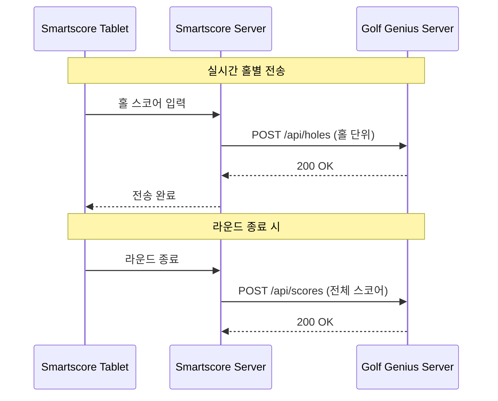

# Golf Genius Live Scoring API

스코어 전송을 위한 Golf Genius Live Scoring API 스펙입니다.

**API 문서 원본**: https://app.swaggerhub.com/apis-docs/GolfGenius/GolfGeniusLiveScoring/1.0.0

---

## 개요

Smartscore 태블릿에서 입력된 스코어를 Golf Genius 서버로 전송하기 위한 API입니다.

### 스코어 전송 흐름



### API 사용 전략

| 시점 | API | 용도 |
|------|-----|------|
| 홀 완료 시 | `POST /api/holes` | 실시간 홀별 스코어 전송 |
| 라운드 종료 시 | `POST /api/scores` | 전체 스코어 확정 전송 |

---

## 인증

| 항목 | 값 |
|------|-----|
| Base URL | `https://www.golfgenius.com` |
| 인증 방식 | Golf Genius 측 확인 필요 |

> **확인 필요**: Live Scoring API 호출 시 인증 방식 (Bearer Token, API Key 등)

---

## API 엔드포인트

### 1. 홀별 스코어 전송 (실시간)

**`POST /api/holes`**

홀 완료 시 해당 홀의 스코어를 실시간으로 전송합니다. 한 조(foursome)의 모든 플레이어 스코어를 한 번에 전송합니다.

#### Request Body

```json
{
  "foursome_id": 461215,
  "hole_number": 6,
  "id": 1,
  "player_ids": [3547772, 3547766, 3547813],
  "scores": [4, 5, 3]
}
```

#### 필드 요약

| 필드 | 타입 | 필수 | 설명 |
|------|------|------|------|
| `foursome_id` | number | Y | 조(Pairing Group) ID |
| `hole_number` | number | Y | 홀 번호 (1-18) |
| `id` | number | Y | 요청 ID (시퀀스 관리용) |
| `player_ids` | number[] | Y | 플레이어 ID 배열 |
| `scores` | number[] | Y | 스코어 배열 (player_ids와 순서 일치) |

#### 스코어 인코딩 (홀별)

| 값 | 의미 |
|----|------|
| `1~20` | 실제 스코어 |
| `-1` | 변경 없음 (기존 스코어 유지) |
| `0` 또는 `null` | 홀 미플레이 |

#### Response

```
HTTP/1.1 200 OK
```

#### 사용 예시 (홀 완료 시)

```bash
curl -X POST "https://www.golfgenius.com/api/holes" \
  -H "Content-Type: application/json" \
  -d '{
    "foursome_id": 461215,
    "hole_number": 6,
    "id": 1,
    "player_ids": [3547772, 3547766, 3547813, 3547820],
    "scores": [4, 5, 3, 4]
  }'
```

---

### 2. 전체 스코어 전송 (라운드 종료)

**`POST /api/scores`**

라운드 종료 시 전체 18홀 스코어를 한 번에 전송합니다. 정합성 보장을 위해 사용합니다.

#### Request Body

```json
{
  "id": 1,
  "player_ids": [3547772, 3547766, 3547813, 3547820],
  "scores": [
    "4,5,3,4,5,4,3,5,4,4,5,3,4,5,4,3,5,4",
    "5,4,4,5,4,5,4,4,5,5,4,4,5,4,5,4,4,5",
    "3,4,3,3,4,3,4,3,4,3,4,3,3,4,3,4,3,4",
    "4,5,4,4,5,4,5,4,5,4,5,4,4,5,4,5,4,5"
  ]
}
```

#### 필드 요약

| 필드 | 타입 | 필수 | 설명 |
|------|------|------|------|
| `id` | number | Y | 요청 ID |
| `player_ids` | number[] | Y | 플레이어 ID 배열 |
| `scores` | string[] | Y | 쉼표 구분 스코어 문자열 배열 (18개 값) |

#### 스코어 인코딩 (전체)

| 값 | 의미 | 예시 |
|----|------|------|
| `1~20` | 실제 스코어 | `"4"` |
| `-1` | 변경 없음 | `"-1"` |
| `-2` | X 스코어 (실격/기권) | `"-2"` |
| `-1 * (100 + N)` | XN 스코어 | `"-107"` = X7, `"-112"` = X12 |
| `0` | 홀 미플레이 | `"0"` |

#### Response

```
HTTP/1.1 200 OK
```

#### 사용 예시 (라운드 종료 시)

```bash
curl -X POST "https://www.golfgenius.com/api/scores" \
  -H "Content-Type: application/json" \
  -d '{
    "id": 1,
    "player_ids": [3547772, 3547766],
    "scores": [
      "4,5,3,4,5,4,3,5,4,4,5,3,4,5,4,3,5,4",
      "5,4,4,5,4,5,4,4,5,5,4,4,5,4,5,4,4,5"
    ]
  }'
```

---

## Payload 필드 상세 설명

### 1. `foursome_id` (조 ID)

#### 개념

```
foursome_id = pairing_group_id = 조 ID
```

Golf Genius API v2에서는 `pairing_group_id`라고 부르고, Live Scoring API에서는 `foursome_id`라고 부릅니다. **같은 개념**입니다.

#### 2명, 3명이면?

| 인원 | 용어 | pairing_group_size |
|------|------|-------------------|
| 2명 | Twosome | 2 |
| 3명 | Threesome | 3 |
| 4명 | **Foursome** | 4 |
| 5명 | Fivesome | 5 |
| 6명 | Sixsome | 6 |

**foursome_id라는 이름이지만, 2명/3명 조도 동일하게 사용합니다.** 단순히 "조 ID"로 이해하면 됩니다.

#### 값은 어디서 오는가?

**Tee Sheet API 또는 Pairing Group 생성 API 응답:**

```json
{
  "pairing_group": {
    "pairing_group_id": 2909534463578552102,
    "pairing_group_id_str": "2909534463578552102",
    "tee_time": {
      "time": "8:10 AM",
      "starting_hole": 1
    }
  }
}
```

→ `pairing_group_id` 값을 `foursome_id`로 사용

---

### 2. `hole_number` (홀 번호)

#### 기본 개념

```
hole_number = 실제 물리적인 홀 번호 (1~18)
```

#### 샷건 스타트 시 (6번 홀부터 시작하는 경우)

```
┌─────────────────────────────────────────────────────────────┐
│ 샷건 스타트 예시                                             │
├─────────────────────────────────────────────────────────────┤
│ 1조: 1번홀 시작 (starting_hole: 1)                          │
│ 2조: 4번홀 시작 (starting_hole: 4)                          │
│ 3조: 6번홀 시작 (starting_hole: 6)  ← 여기서 시작           │
│ 4조: 10번홀 시작 (starting_hole: 10)                        │
└─────────────────────────────────────────────────────────────┘
```

**3조가 6번홀부터 시작해서 7번홀 완료 시:**

```json
{
  "foursome_id": 461215,
  "hole_number": 7,
  "player_ids": [3547772, 3547766, 3547813],
  "scores": [4, 5, 3]
}
```

**플레이 순서 (3조 기준):**

```
6 → 7 → 8 → 9 → 10 → 11 → 12 → 13 → 14 → 15 → 16 → 17 → 18 → 1 → 2 → 3 → 4 → 5
│                                                              │
└─ 시작                                             18홀 완료 ─┘
```

**각 홀 완료 시 API 호출 (hole_number는 항상 실제 홀 번호):**

```
POST /api/holes { "hole_number": 6, ... }   // 첫 홀
POST /api/holes { "hole_number": 7, ... }
...
POST /api/holes { "hole_number": 18, ... }
POST /api/holes { "hole_number": 1, ... }   // 1번홀로 돌아옴
...
POST /api/holes { "hole_number": 5, ... }   // 마지막 홀
```

---

### 3. `id` (로컬 시퀀스 인덱스)

#### 개념

```
id = Smartscore에서 자체 관리하는 요청 순서 번호
```

Golf Genius가 아니라 **Smartscore가 직접 생성하고 관리**해야 합니다.

#### 용도

- 스코어 저장 순서 추적
- 중복 요청 감지
- 디버깅/로깅

#### 구현 방법

```java
// 라운드 시작 시
int requestId = 0;

// 홀 완료할 때마다
requestId++;
sendScore(requestId, foursomeId, holeNumber, playerIds, scores);

// 예시 시퀀스
// 1번홀 완료: id=1
// 2번홀 완료: id=2
// 3번홀 완료: id=3
// ...
```

#### 주의사항

- **라운드 단위**로 시퀀스 관리 권장 (새 라운드 시작 시 1부터 다시)
- Golf Genius 측에서 `id` 기반 중복 체크 가능성 있음

---

### 4. `player_ids` (플레이어 ID 배열)

#### 핵심: "Order is important" (순서가 중요!)

```
player_ids[0] → scores[0]
player_ids[1] → scores[1]
player_ids[2] → scores[2]
player_ids[3] → scores[3]
```

#### 값은 어디서 오는가?

**Tee Sheet API 응답** (`GET /api_v2/{api_key}/events/{event_id}/rounds/{round_id}/tee_sheet`):

```json
{
  "golfers": [{
    "last_name": "홍",
    "first_name": "길동",
    "player_roster_id": "5482877",
    "player_round_id": "21836274",
    "player_GGID": "kkhixnr"
  }]
}
```

#### 어떤 ID를 사용해야 하는가?

| ID 종류 | 설명 | 사용 여부 |
|---------|------|----------|
| `player_round_id` | 라운드별 참가 ID | ✅ **가장 유력** |
| `player_roster_id` | Event 참가 ID | ⚠️ 가능성 있음 |
| `player_GGID` | Golf Genius 고유 ID (문자열) | ⚠️ 확인 필요 |

> **Golf Genius에 확인 필요**: Live Scoring API의 `player_ids`에 어떤 ID를 사용해야 하는지

---

### 5. `scores` 배열 구조 (`/api/scores` 전용)

#### player_ids와 scores의 매핑

```
player_ids[0] = 101  →  scores[0] = "4,5,3,4,5,4,3,5,4,4,5,3,4,5,4,3,5,4"
player_ids[1] = 102  →  scores[1] = "5,4,4,5,4,5,4,4,5,5,4,4,5,4,5,4,4,5"
...
```

#### 각 scores 문자열 내부 구조

```
"4,5,3,4,5,4,3,5,4,4,5,3,4,5,4,3,5,4"
 │ │ │ │ │ │ │ │ │ │  │  │  │  │  │  │  │  │
 1 2 3 4 5 6 7 8 9 10 11 12 13 14 15 16 17 18  ← 홀 번호
```

**반드시 18개 요소**가 있어야 함 (쉼표로 구분)

#### 예시: 6홀까지만 플레이한 경우

```json
{
  "id": 1,
  "player_ids": [101],
  "scores": [
    "4,5,3,4,5,4,-1,-1,-1,-1,-1,-1,-1,-1,-1,-1,-1,-1"
  ]
}
//              ↑ 1~6홀 스코어  ↑ 7~18홀은 -1 (아직 미플레이)
```

---

## 전체 연동 흐름 예시

### 1단계: Tee Sheet 조회 (Smartscore → Golf Genius)

```
GET /api_v2/{api_key}/events/{event_id}/rounds/{round_id}/tee_sheet
```

**응답:**

```json
{
  "pairing_group": {
    "pairing_group_id": 461215,
    "tee_time": {
      "time": "8:00 AM",
      "starting_hole": 6
    }
  },
  "golfers": [
    { "first_name": "길동", "last_name": "홍", "player_round_id": "3547772" },
    { "first_name": "철수", "last_name": "김", "player_round_id": "3547766" },
    { "first_name": "영희", "last_name": "이", "player_round_id": "3547813" }
  ]
}
```

**Smartscore 저장:**

```
foursome_id = 461215
player_ids = [3547772, 3547766, 3547813]
starting_hole = 6
```

### 2단계: 실시간 스코어 전송 (홀 완료 시)

```json
// 6번홀 완료 시 (첫 홀)
POST /api/holes
{
  "foursome_id": 461215,
  "hole_number": 6,
  "id": 1,
  "player_ids": [3547772, 3547766, 3547813],
  "scores": [4, 5, 3]
}

// 7번홀 완료 시
POST /api/holes
{
  "foursome_id": 461215,
  "hole_number": 7,
  "id": 2,
  "player_ids": [3547772, 3547766, 3547813],
  "scores": [5, 4, 4]
}
```

### 3단계: 라운드 종료 시 전체 전송

```json
POST /api/scores
{
  "id": 19,
  "player_ids": [3547772, 3547766, 3547813],
  "scores": [
    "4,5,3,4,5,4,3,5,4,4,5,3,4,5,4,3,5,4",
    "5,4,4,5,4,5,4,4,5,5,4,4,5,4,5,4,4,5",
    "3,4,3,3,4,3,4,3,4,3,4,3,3,4,3,4,3,4"
  ]
}
```

---

## Smartscore 구현 가이드

### 실시간 전송 로직

```
홀 완료 이벤트 발생
    │
    ├── 네트워크 정상? ──Yes──> POST /api/holes 전송
    │       │
    │       └── 실패 시 로컬 큐에 저장
    │
    └── 네트워크 불안정? ──> 로컬 저장 후 복구 시 재전송
```

### 라운드 종료 전송 로직

```
라운드 종료 버튼 클릭
    │
    ├── 전체 18홀 스코어 수집
    │
    ├── POST /api/scores 전송
    │
    └── 실패 시 재시도 (최대 3회)
```

### 에러 처리

| 상황 | 대응 |
|------|------|
| 네트워크 타임아웃 | 로컬 저장 후 백그라운드 재시도 |
| 4xx 에러 | 요청 데이터 검증 후 재전송 |
| 5xx 에러 | 지수 백오프로 재시도 |
| ACK 미수신 | 동일 요청 재전송 (멱등성 보장 필요) |

---

## Golf Genius 확인 필요 사항

| 항목 | 질문 |
|------|------|
| `foursome_id` | Tee Sheet API의 `pairing_group_id`를 그대로 사용하면 되는지? |
| `player_ids` | `player_round_id`, `player_roster_id`, `player_GGID` 중 어느 것을 사용해야 하는지? |
| 인증 | Live Scoring API (`/api/holes`, `/api/scores`) 호출 시 인증 방식은? |

---

## 관련 문서

- [API Reference](./README.md) - API 전체 개요
- [Golf Genius API v2](./golfgeniusapiv2.apib) - Tee Sheet, Pairing Group 등 마스터 데이터 API
- [설계 문서](../design/sync-strategy.md) - Outbound 동기화 전략
