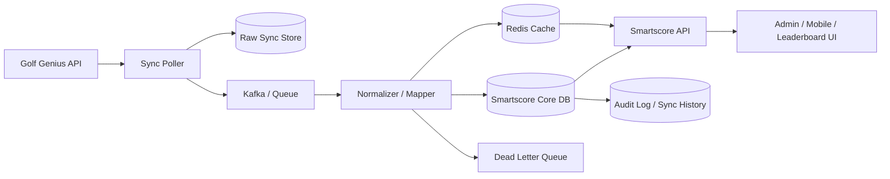
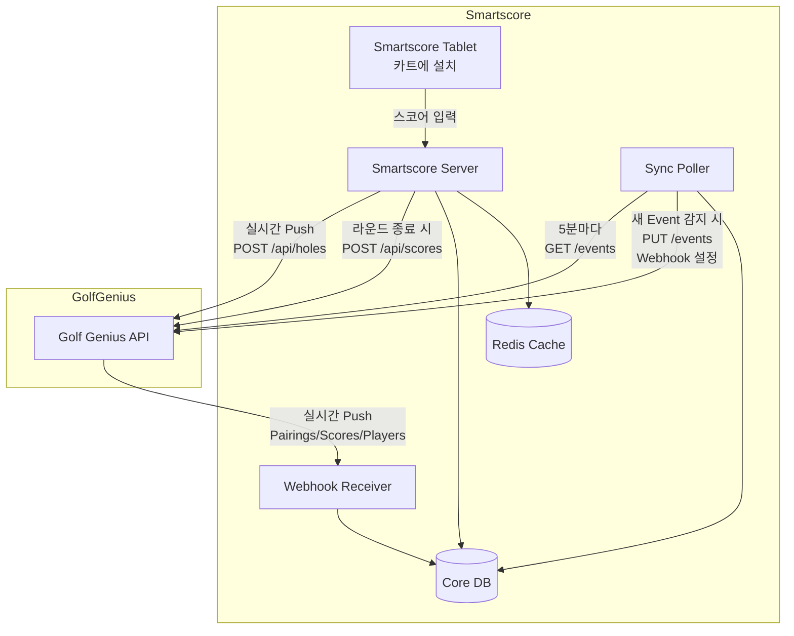
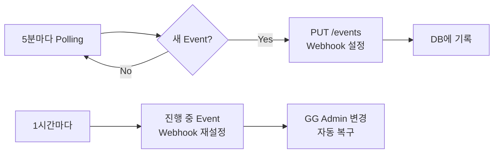
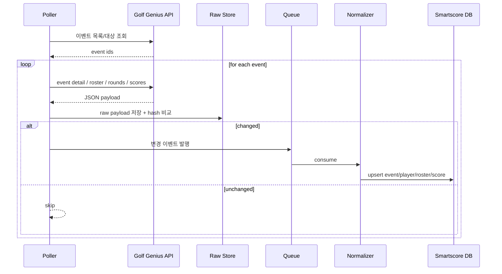

# Smartscore 연동용 시스템 아키텍처

[← 데이터 모델](./data-model.md) | [다음: 동기화 전략 →](./sync-strategy.md)

---

## 설계 목표

Smartscore 입장에서 필요한 목표는 다음과 같다:

1. Golf Genius에서 바뀐 데이터를 누락 없이 가져온다.
2. 외부 API 장애나 지연에도 내부 서비스는 안정적으로 유지한다.
3. 실시간처럼 보여도, 실제 외부 연동은 느슨하게 결합한다.
4. 중복 수신/재처리/순서 뒤바뀜에 안전해야 한다.
5. 향후 webhook이 생겨도 구조를 크게 바꾸지 않도록 한다.

---

## 아키텍처 개요

---

## 양방향 데이터 흐름

Smartscore와 Golf Genius 간의 연동은 **양방향 구조**로 설계되어야 한다.

### Inbound: Golf Genius → Smartscore (마스터 데이터)

- League, Season, Event, Roster, Round, Pairing 정보
- Polling 방식으로 주기적 동기화
- 상위 식별자 계층이 먼저 안정적으로 매핑되어야 스코어 처리 가능

### Outbound: Smartscore → Golf Genius (스코어 데이터)

- Smartscore Tablet에서 입력된 스코어
- 실시간 전송 (홀 완료 시) + 라운드 종료 시 전체 재전송
- 네트워크 장애 시 로컬 저장 후 복구 시 일괄 전송

### Inbound 연동 방식: Hybrid (Polling + Webhook)

Golf Genius는 **Webhook과 Polling 모두 지원**한다. Smartscore는 Hybrid 전략을 사용한다.

| 방식 | 용도 | 주기 |
|------|------|------|
| Polling | 새 Event 감지, Webhook 자동 설정 | 5분 |
| Webhook | 실시간 변경 수신 (Pairings, Scores, Players) | 실시간 |
| 재설정 | 진행 중 Event Webhook 재설정 (GG Admin 변경 대응) | 1시간 |

### 양방향 아키텍처 다이어그램

### Webhook 자동 설정 흐름

---

## 컴포넌트별 역할

### 1) Sync Poller

- Golf Genius API를 주기적으로 호출한다.
- 전체조회보다 `변경 가능성이 높은 범위`를 우선 조회한다.
- 예: 오늘 경기 중 Event는 30초~1분, 미래 이벤트는 10분, 종료된 이벤트는 1일 1회 재검증.

### 2) Raw Sync Store

- 외부 응답 원본 JSON을 저장한다.
- 원인 분석, 재처리, 스키마 변경 대응에 매우 유용하다.
- 테이블 구조: `gg_sync_raw(id, entity_type, entity_id, polled_at, payload_json, hash, status)`

### 3) Queue / Kafka

- 외부 수집과 내부 반영을 분리한다.
- Poller가 느려져도 API 서버/업무 서버와 격리된다.
- 스코어, 로스터, 이벤트, 라운드 각각 토픽을 분리하면 운영이 편하다.

### 4) Normalizer / Mapper

- Smartscore 내부 스키마로 Golf Genius 응답을 변환한다.
- `Player`, `Roster Entry`, `Event`, `Round`, `Score`를 내부 엔터티에 매핑한다.
- 외부 명칭이 바뀌거나 필드가 추가되어도 여기만 조정하면 된다.

### 5) Core DB

- 정규화된 현재 상태 저장.
- 사용자 화면, 관리자 화면, 통계, 이력 추적의 소스 오브 트루스.

### 6) Cache / Redis

- 실시간 리더보드처럼 자주 읽는 화면을 캐시한다.
- API 호출 시 매번 다중 조인을 하지 않도록 한다.

### 7) Audit / Sync History

- 어떤 시점에 무엇을 가져왔고 무엇이 바뀌었는지 남긴다.
- 장애 분석과 정합성 검증에 필수.

### 8) Dead Letter Queue (DLQ)

- 처리 실패한 메시지를 보관.
- 운영자가 수동으로 재처리하거나 분석할 수 있다.

---

## Cursor 기반 Delta Sync

Golf Genius 공개 문서만으로는 모든 엔드포인트의 `updated_since` 지원 여부를 단정할 수 없다. 따라서 아래 우선순위로 설계한다:

1. API가 수정시각 필터를 제공하면 그 값 사용
2. 없으면 대상 집합(Event IDs)을 먼저 좁힌 뒤 상세 조회
3. 응답 JSON 해시 비교로 변경 여부 판정
4. 멱등 upsert 적용

---

## 실시간 UI 구성

외부가 polling이어도 내부 사용자는 실시간처럼 볼 수 있어야 한다.

- **외부 → Poller**: 30초~5분 단위
- **내부 → Redis/DB**: 변경 즉시 반영
- **내부 → 클라이언트**: WebSocket/SSE push

즉, **"외부는 준실시간, 내부 UX는 실시간"** 구조로 설계한다.

---

## 장애 대응 원칙

| 상황 | 대응 방법 |
|------|-----------|
| 외부 API timeout, 429, 5xx | 재시도하되 지수 백오프 적용 |
| 중복 수신 | 같은 entity는 멱등 키로 upsert |
| 순서 뒤집힘 | `last_seen_version` 또는 `last_synced_at` 비교 |
| 부분 실패 | DLQ로 보내고 운영자가 재처리 |
| API rate limit | event priority queue 적용 |

---

## 배치 우선순위

### 고빈도 (30초~1분)
- 오늘 진행 중인 Event의 leaderboard / score / round 상태

### 중간빈도 (5~10분)
- 당일/내일 이벤트 roster / pairing / registration 상태

### 저빈도 (1시간~1일)
- 시즌 포인트, 과거 이벤트 재검증, 마스터 플레이어 보정

---

[← 데이터 모델](./data-model.md) | [다음: 동기화 전략 →](./sync-strategy.md)
