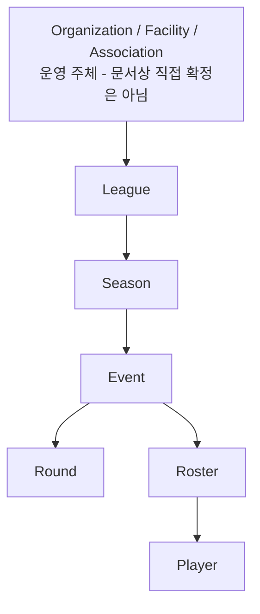
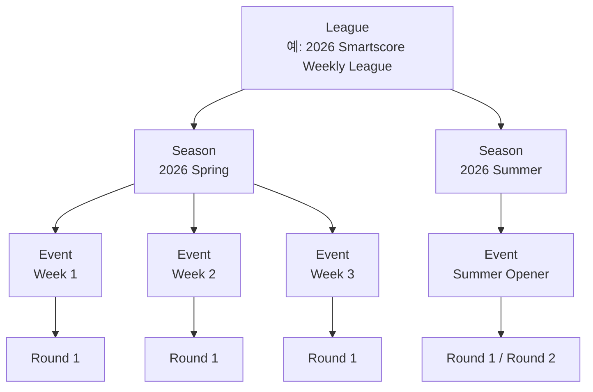
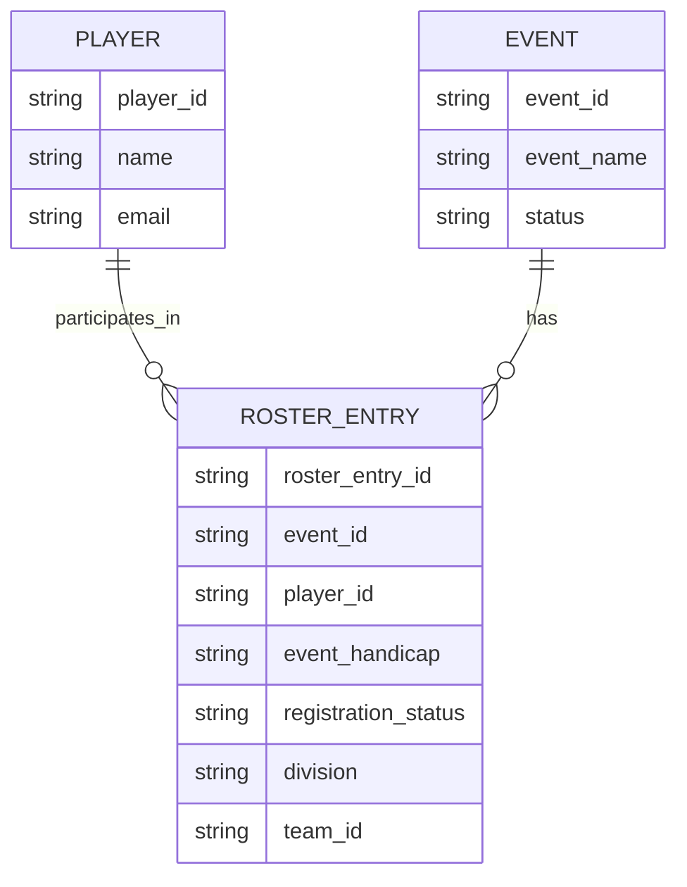
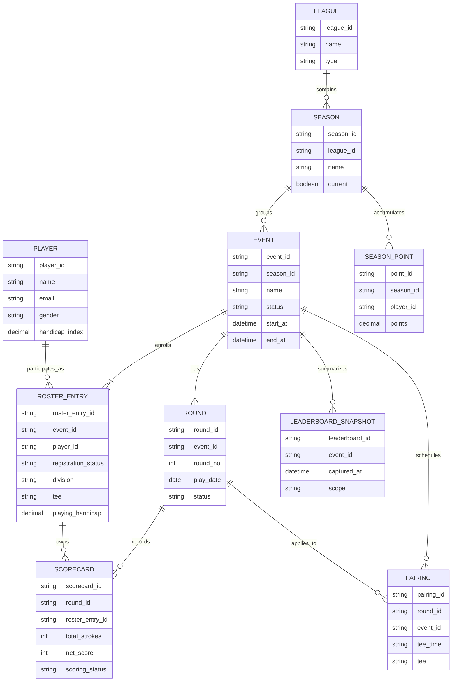
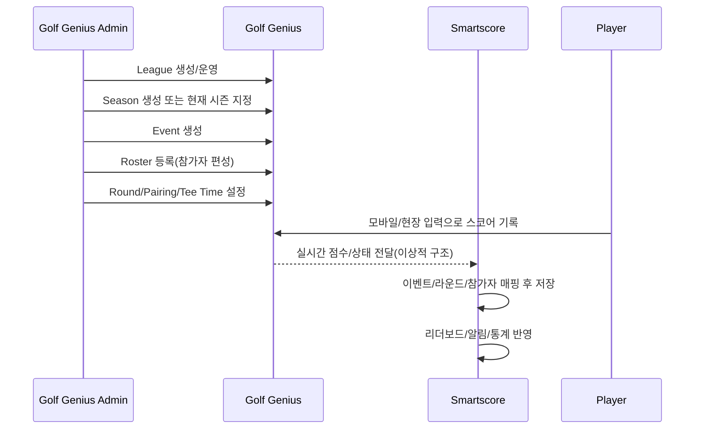
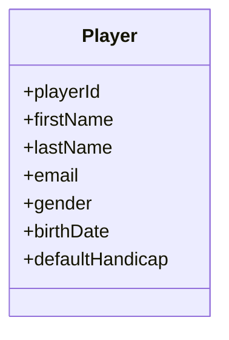

# Golf Genius 데이터 모델

[← 용어 정의](./terminology.md) | [다음: 시스템 아키텍처 →](./architecture.md)

---

## 계층 관계 다이어그램



> 상단의 Organization / Facility / Association 계층은 Golf Genius 공개 사이트에서
> "clubs, associations, resorts, tours"라는 운영 주체 설명에 기반한 상위 개념 해석이다.
> API 문서에 반드시 동일 명칭으로 존재한다고 단정할 수는 없다.

---

## League / Season / Event 계층 상세



---

## ERD (Entity Relationship Diagram)

### 기본 ERD



### 전체 ERD



---

## 운영 흐름 시퀀스 다이어그램



---

## 권장 내부 테이블 모델

### 마스터 테이블

| 테이블명 | 용도 |
|----------|------|
| `gg_league` | 리그 정보 |
| `gg_season` | 시즌 정보 |
| `gg_event` | 이벤트/대회 정보 |
| `gg_round` | 라운드 정보 |
| `gg_player` | 플레이어 마스터 |

### 관계/운영 테이블

| 테이블명 | 용도 |
|----------|------|
| `gg_event_participant` | Roster Entry 용 (이벤트 참가자) |
| `gg_round_pairing` | 조편성/티타임 |
| `gg_scorecard` | 스코어카드 |
| `gg_leaderboard_snapshot` | 리더보드 스냅샷 |
| `gg_season_point` | 시즌 포인트 |

### 기술 운영 테이블

| 테이블명 | 용도 |
|----------|------|
| `gg_sync_cursor` | 동기화 커서 관리 |
| `gg_sync_raw` | 원본 JSON 저장 |
| `gg_sync_job_history` | 동기화 작업 이력 |
| `gg_sync_error` | 동기화 오류 기록 |

### 추천 Player 클래스 다이어그램



---

## 권장 식별 구조

스코어 데이터의 권장 식별 구조:

```text
league_id?
season_id?
event_id
round_id
roster_entry_id
hole_number
score_type
score_value
updated_at
```

---

## 핵심 관계 요약

- League는 여러 Season을 가진다.
- Season은 여러 Event를 가진다.
- Event는 하나 이상의 Round를 가진다.
- Event는 하나의 Roster를 가지며, Roster에는 여러 RosterEntry가 포함된다.
- 각 RosterEntry는 하나의 Player를 참조한다.
- Score는 Round + RosterEntry(또는 Player) 기준으로 기록된다.
- Leaderboard는 Event/Season/League 범위에서 집계된다.

---

[← 용어 정의](./terminology.md) | [다음: 시스템 아키텍처 →](./architecture.md)
