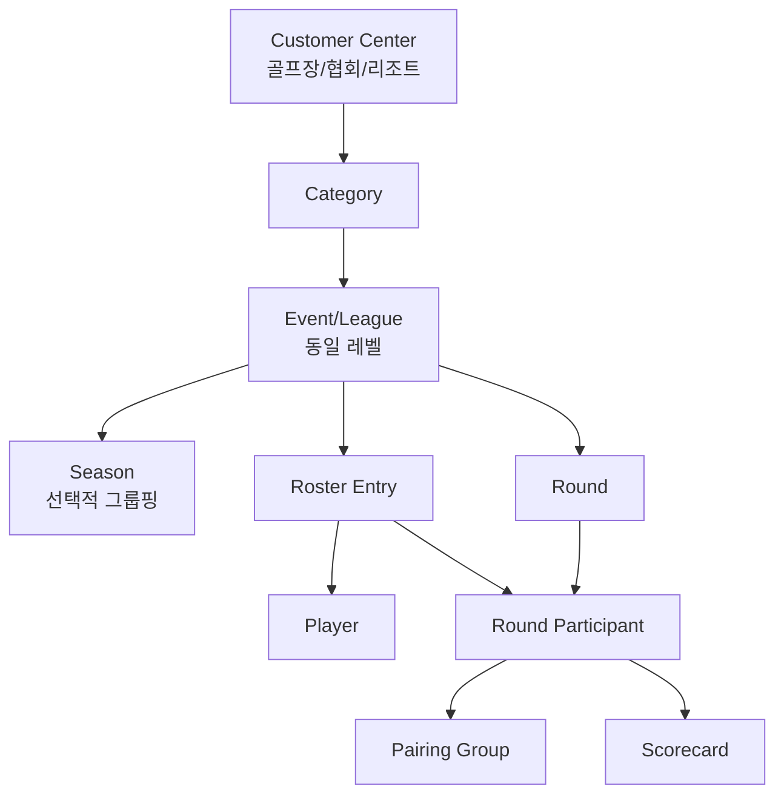
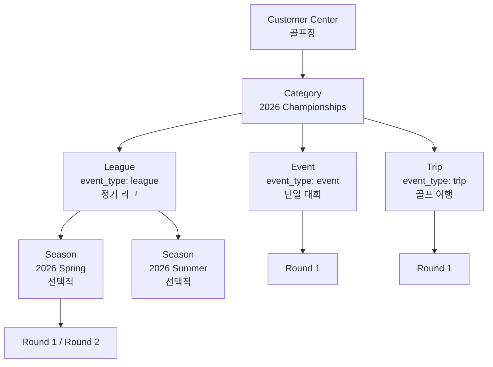
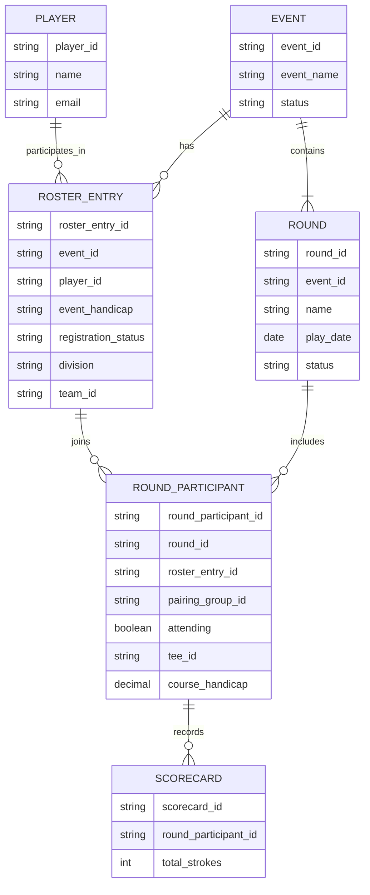
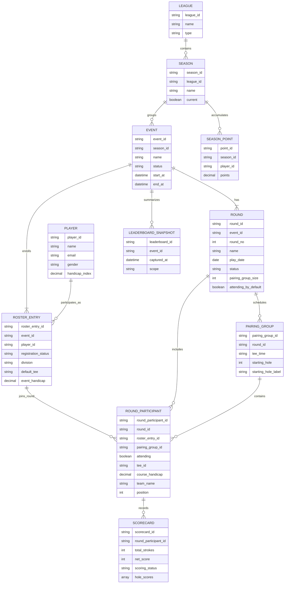
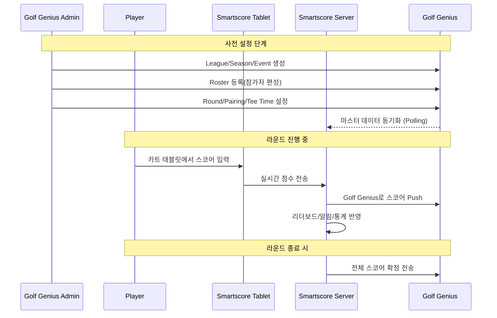
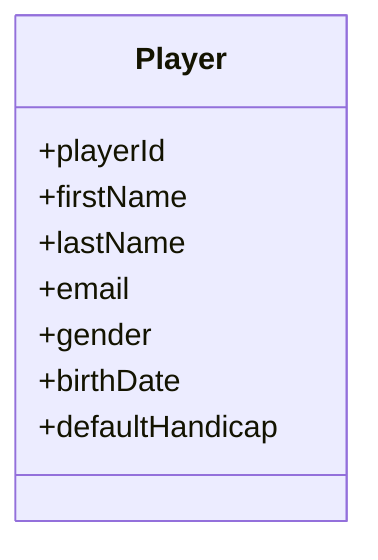

# Golf Genius 데이터 모델

[← 용어 정의](./terminology.md) | [다음: 시스템 아키텍처 →](./architecture.md)

---

## 계층 관계 다이어그램



> **중요**: Golf Genius에서 **League와 Event는 동일 레벨**이다.
> - `event_type`: "event" | "league" | "trip" | "dcp"
> - League는 Event의 한 종류이며, 별도의 상위 계층이 아니다.
> - Season은 선택적 그룹핑이며, League 없이도 Event에 직접 연결될 수 있다.

---

## Round vs Pairing Group 개념 구분

Golf Genius API에서 Round와 Pairing Group은 서로 다른 개념이다.

### Round (라운드)

**Round = 날짜 기반 경기 단위**

```
Event: "3월 1주 Championship"
├── Round 1: 토요일 (2026-03-07)
└── Round 2: 일요일 (2026-03-08)
```

API 응답 예시:
```json
{
  "round": {
    "id": "2794531013441653808",
    "name": "Round 1",
    "date": "2017-08-16",
    "status": "in progress",
    "pairing_group_size": 4
  }
}
```

Round가 가지는 속성:
- `date`: 경기 날짜
- `name`: "Round 1", "Final Round" 등
- `status`: "not started", "in progress", "completed"
- `pairing_group_size`: 조별 인원 수 (2=twosome, 3=threesome, **4=foursome**)
- `playing_divisions`: 해당 라운드에 참가하는 디비전

### Pairing Group (조편성)

**Pairing Group = 함께 플레이하는 선수 그룹 (4명 1조 = Foursome)**

```
Round 1 (토요일)
├── Pairing Group 1: 홍길동, 김철수, 이영희, 박민수 (08:00 AM)
├── Pairing Group 2: 최지훈, 정수민, 강다은, 윤서준 (08:10 AM)
└── Pairing Group 3: ...
```

Pairing Group이 가지는 속성:
- `tee_time`: 티오프 시간 (예: "08:00 AM")
- `starting_hole`: 시작 홀 (샷건 스타트 시)
- `players`: 해당 조에 배정된 선수 목록

### Round Participant (라운드별 참가자)

**핵심 개념: Event Roster에 등록되었더라도 모든 Round에 참가하는 것은 아니다.**

예시:
- 홍길동: "3월 1주 Championship" Event에 Roster 등록
- 토요일 Round 1: 참가 ✅
- 일요일 Round 2: 불참 ❌

API에서 확인되는 Round별 참가 정보:
```json
{
  "player_roster_id": "5482877",    // Event Roster 참가 ID
  "player_round_id": "21836274",    // Round별 참가 ID ← 핵심!
  "attending": true
}
```

Round 생성 시 설정:
> `attending_by_default` - "States whether members added to the roster of **this round** will be marked as 'Attending' by default"

### 전체 관계 다이어그램

```
┌─────────────────────────────────────────────────────────────────────┐
│ Event: "3월 1주 Championship"                                        │
│                                                                     │
│  Roster (Event 참가 등록)                                            │
│  ┌──────────┐ ┌──────────┐ ┌──────────┐ ┌──────────┐              │
│  │ 홍길동    │ │ 김철수    │ │ 이영희    │ │ 박민수    │              │
│  └──────────┘ └──────────┘ └──────────┘ └──────────┘              │
│       │            │            │            │                      │
└───────┼────────────┼────────────┼────────────┼──────────────────────┘
        │            │            │            │
        ▼            ▼            ▼            ▼
┌─────────────────────────────────────────────────────────────────────┐
│ Round 1 (토요일)                                                     │
│                                                                     │
│  Round Participants (라운드별 참가)                                   │
│  ┌──────────┐ ┌──────────┐ ┌──────────┐ ┌──────────┐              │
│  │ 홍길동 ✅ │ │ 김철수 ✅ │ │ 이영희 ✅ │ │ 박민수 ✅ │              │
│  └──────────┘ └──────────┘ └──────────┘ └──────────┘              │
│       └──────────┴──────────┴──────────┘                           │
│                        │                                            │
│                        ▼                                            │
│              ┌─────────────────┐                                    │
│              │ Pairing Group 1  │                                    │
│              │ Tee Time: 08:00  │                                    │
│              │ 홍길동, 김철수,   │                                    │
│              │ 이영희, 박민수    │                                    │
│              └─────────────────┘                                    │
└─────────────────────────────────────────────────────────────────────┘
        │            │                         │
        ▼            ▼                         │
┌─────────────────────────────────────────────────────────────────────┐
│ Round 2 (일요일)                                                     │
│                                                                     │
│  Round Participants (라운드별 참가)                                   │
│  ┌──────────┐ ┌──────────┐ ┌──────────┐                            │
│  │ 홍길동 ❌ │ │ 김철수 ✅ │ │ 이영희 ✅ │  ← 홍길동은 일요일 불참     │
│  └──────────┘ └──────────┘ └──────────┘                            │
└─────────────────────────────────────────────────────────────────────┘
```

---

## Event/League 계층 상세

### League = Event (동일 레벨)

Golf Genius에서 **League와 Event는 동일 레벨**이다. League는 `event_type="league"`인 Event이다.



### event_type 종류

| event_type | 설명 | 예시 |
|------------|------|------|
| `event` | 단일 대회 | 토너먼트, 챔피언십 |
| `league` | 정기 리그 | Weekly League, Monthly League |
| `trip` | 골프 여행 | 단체 골프 투어 |
| `dcp` | Daily Club Play | 일일 클럽 플레이 |

### Season의 역할

- Season은 **선택적 그룹핑**이다.
- League(event_type="league")에서 주로 사용된다.
- Event(event_type="event")에도 Season을 연결할 수 있지만 필수는 아니다.

---

## ERD (Entity Relationship Diagram)

### 기본 ERD



**핵심 포인트**: `ROUND_PARTICIPANT`는 Event Roster에 등록된 선수가 특정 Round에 참가하는지 여부를 관리한다. Golf Genius API의 `player_round_id`에 해당한다.

### 전체 ERD



### ERD 핵심 관계 설명

| 관계 | 설명 |
|------|------|
| `ROSTER_ENTRY → ROUND_PARTICIPANT` | Event에 등록한 선수가 특정 Round에 참가 |
| `ROUND → ROUND_PARTICIPANT` | Round에 참가하는 선수 목록 |
| `ROUND → PAIRING_GROUP` | Round에 속한 조(Foursome) 목록 |
| `PAIRING_GROUP → ROUND_PARTICIPANT` | 조에 배정된 참가자 (1:N, `pairing_group_id`로 연결) |
| `ROUND_PARTICIPANT → SCORECARD` | 라운드 참가자의 스코어 기록 |

### API 필드 매핑

| ERD 엔티티 | Golf Genius API 필드 | 설명 |
|------------|---------------------|------|
| `ROSTER_ENTRY.roster_entry_id` | `player_roster_id` | Event 참가 ID |
| `ROUND_PARTICIPANT.round_participant_id` | `player_round_id` | Round 참가 ID |
| `ROUND_PARTICIPANT.pairing_group_id` | (pairing_group 내 위치로 추론) | 조 배정 연결 |
| `PAIRING_GROUP.pairing_group_id` | `pairing_group.id` | 조 ID |
| `ROUND.pairing_group_size` | `pairing_group_size` | 조별 인원 (2=twosome, 4=foursome) |

---

## 운영 흐름 시퀀스 다이어그램



> **양방향 연동 구조 핵심**
> - **Inbound (GG → SS)**: 마스터 데이터 (League/Event/Roster) Polling
> - **Outbound (SS → GG)**: 스코어 데이터 실시간 Push
> - 스코어 입력은 **Smartscore Tablet**에서 이루어지며, Smartscore Server를 통해 Golf Genius로 전송된다.

---

## 권장 내부 테이블 모델

### 마스터 테이블

| 테이블명 | 용도 |
|----------|------|
| `gg_league` | 리그 정보 |
| `gg_season` | 시즌 정보 |
| `gg_event` | 이벤트/대회 정보 |
| `gg_round` | 라운드 정보 |
| `gg_player` | 플레이어 마스터 |

### 관계/운영 테이블

| 테이블명 | 용도 | Golf Genius API 참조 |
|----------|------|---------------------|
| `gg_event_participant` | Roster Entry 용 (이벤트 참가자) | `player_roster_id` |
| `gg_round_participant` | 라운드별 참가자 (핵심!) | `player_round_id` |
| `gg_pairing_group` | 조편성 (4명 1조) | `pairing_group.id` |
| `gg_scorecard` | 스코어카드 | - |
| `gg_leaderboard_snapshot` | 리더보드 스냅샷 | - |
| `gg_season_point` | 시즌 포인트 | - |

> **중요**:
> - `gg_round_participant` 테이블은 Event Roster에 등록된 선수가 특정 Round에 실제로 참가하는지 여부를 관리한다.
> - `gg_round_participant.pairing_group_id`로 조편성(Pairing Group)과 연결된다.
> - 같은 Event라도 Round별로 참가 여부와 조편성이 다를 수 있다.

### 기술 운영 테이블

| 테이블명 | 용도 |
|----------|------|
| `gg_sync_cursor` | 동기화 커서 관리 |
| `gg_sync_raw` | 원본 JSON 저장 |
| `gg_sync_job_history` | 동기화 작업 이력 |
| `gg_sync_error` | 동기화 오류 기록 |

### 추천 Player 클래스 다이어그램



---

## 권장 식별 구조

스코어 데이터의 권장 식별 구조:

```text
league_id?
season_id?
event_id
round_id
round_participant_id    ← player_round_id에 해당
roster_entry_id         ← player_roster_id에 해당
hole_number
score_type
score_value
updated_at
```

### 참가 계층 식별 구조

```
Player (마스터)
  └── Roster Entry (Event 참가 등록)
        └── Round Participant (Round별 참가)
              ├── Pairing Group 배정
              └── Scorecard (스코어 기록)
```

---

## 핵심 관계 요약

### 계층 관계
- League는 여러 Season을 가진다.
- Season은 여러 Event를 가진다.
- Event는 하나 이상의 Round를 가진다. (예: 토요일 Round, 일요일 Round)

### 참가 관계
- Event는 하나의 Roster를 가지며, Roster에는 여러 Roster Entry가 포함된다.
- 각 Roster Entry는 하나의 Player를 참조한다.
- **Roster Entry는 여러 Round Participant를 가질 수 있다.** (핵심!)
- Round Participant는 특정 Round에 실제로 참가하는 선수를 나타낸다.

### 조편성 관계
- Round는 여러 Pairing Group(조)을 가진다.
- 각 Pairing Group에는 여러 Round Participant가 배정된다. (보통 4명 = Foursome)

### 스코어 관계
- Score는 **Round Participant** 기준으로 기록된다. (`player_round_id`)
- Leaderboard는 Event/Season/League 범위에서 집계된다.

### 요약 다이어그램

```
Player
  │
  └── Roster Entry (Event 등록)
        │
        ├── Round Participant (토요일 참가) ──→ Scorecard
        │         │
        │         └── Pairing Group 배정
        │
        └── Round Participant (일요일 참가) ──→ Scorecard
                  │
                  └── Pairing Group 배정
```

---

[← 용어 정의](./terminology.md) | [다음: 시스템 아키텍처 →](./architecture.md)
