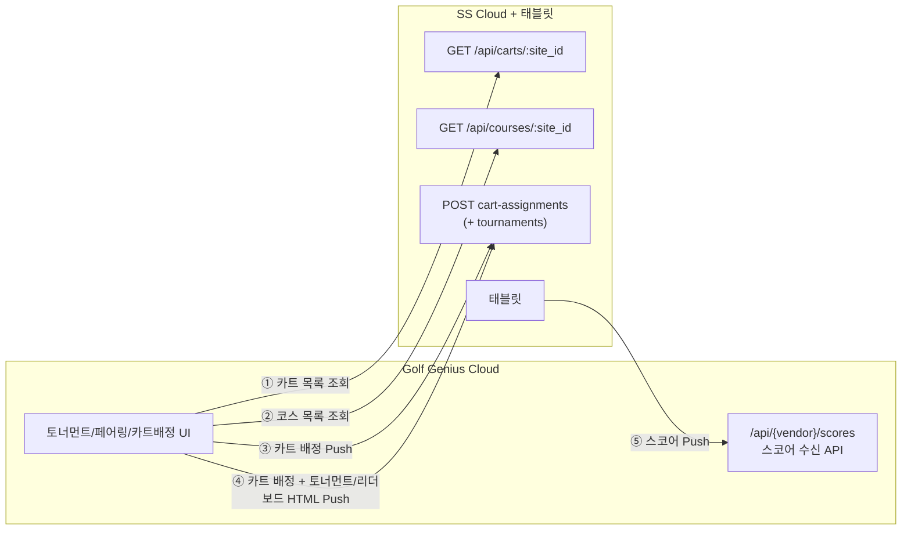
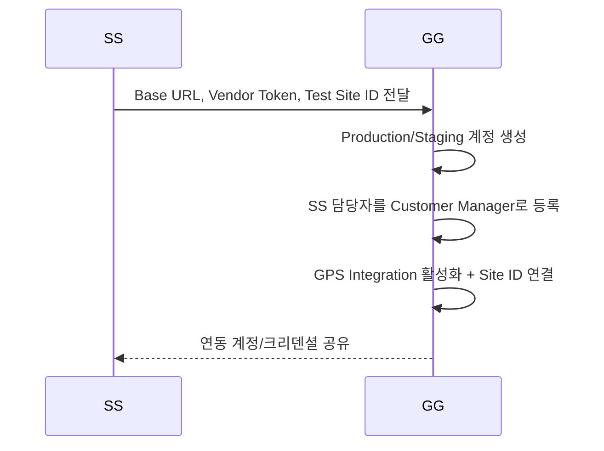
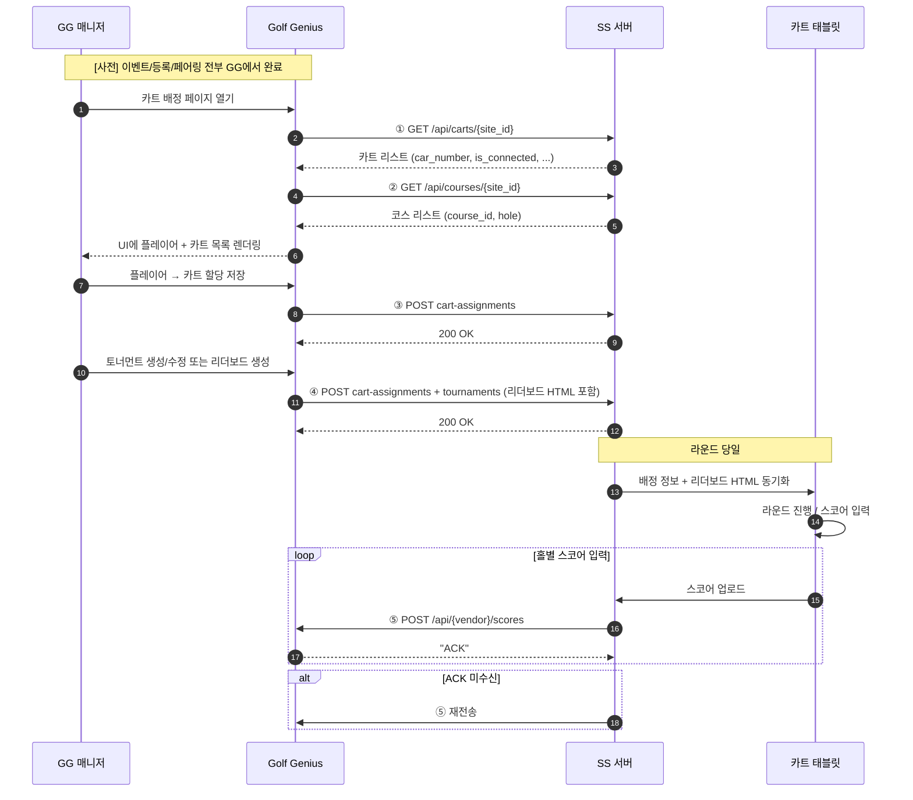
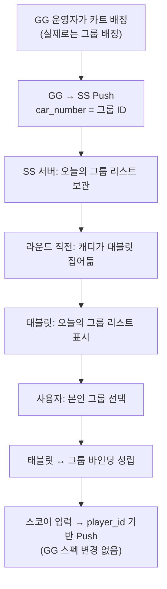

# GG GPS Integration Tutorial 상세 분석 및 SS 구현 가이드

> 원문: Golf Genius 제공 "GPS Integration Tutorial" (Alex Belc, February 2025)
> 목적: 원문을 한글로 정확히 풀어 설명하고, SS(Smartscore, GPS Provider 입장)가 어떻게 구현·지원해야 하는지를 정리

---

## 0. 전체 개요

Golf Genius(이하 **GG**)가 GPS 벤더(Vendor, 이하 **SS**)와 연동할 때 사용하는 표준 모델은 **"GPS Units API"** 입니다. 이 모델은 Visage·E-Z-GO 등에서 사용 중이며 특징은 다음과 같습니다.

- **이벤트/등록/페어링은 전부 GG 내부에서 완료**
- **당일 카트 배정만 GG → SS로 Push**
- **스코어는 SS → GG로 Push**
- **선택적으로 리더보드 HTML을 SS가 카트에 표시**

SS는 **GG에게 4개의 엔드포인트를 제공**하고, **GG가 제공하는 1개의 엔드포인트를 호출**합니다. 총 5개의 접점으로 연동이 구성됩니다.



---

## 1. 연동 시작 전 준비 사항

### 1.1 SS가 GG에 전달해야 하는 것

| 항목 | 설명 | 예시 |
|---|---|---|
| **Base URL** | GG가 SS API를 호출할 때 쓸 기준 URL | `https://smartscore.com/api/...` |
| **Vendor Token** | 모든 요청의 유효성 검증용 공유 시크릿. body에 포함, 필요 시 header에도 복제 가능 | `SS_TOKEN_abc123xyz` |
| **Test Site ID** | 구현·테스트용 시설 식별자 (SS 내부 ID) | `50` |

### 1.2 GG가 준비하는 것

- SS용 **Production / Staging 계정** 생성
- SS 측 담당자를 **Customer Manager**로 등록
- 해당 계정에 **GPS Integration 활성화 + 위 Site ID 연결**



---

## 2. SS가 구현해야 하는 4개 엔드포인트

### 2.1 ① `GET /api/carts/{site_id}` — 카트 목록 조회

**언제 호출되는가?** 토너먼트 매니저가 GG에서 **카트 배정 페이지를 열 때마다** 호출됩니다. 첨부 이미지(우측 Carts 패널)가 바로 이 데이터가 렌더링되는 화면입니다.

**응답 포맷:**

```json
[
  { "car_number": 77,  "is_connected": true,  "is_on_course": true,  "is_staged": false },
  { "car_number": 223, "is_connected": false, "is_on_course": false, "is_staged": false }
]
```

**필드 의미:**

| 필드 | 의미 | GG UI 반영 |
|---|---|---|
| `car_number` | 카트 고유 번호 (벤더 내부 식별자) | "Carts" 리스트의 번호 (예: 617983) |
| `is_connected` | 카트 디바이스가 네트워크에 연결되어 있는가 | `Show Connected Carts` 체크박스 필터 |
| `is_on_course` | 해당 카트가 현재 코스에 나가 있는가 | 상태 표시 |
| `is_staged` | 해당 카트가 스테이징(대기) 상태인가 | `Show Staged Carts` 체크박스 필터 |

> **SS 구현 포인트**
> - `site_id`별로 카트 전체를 조회하는 간단한 GET API
> - **인증**: 쿼리스트링 또는 Basic Auth로 Vendor Token 검증(GG 측이 어떤 방식을 쓰는지 문서엔 명시 없음 → 연동 킥오프 시 확인 필요)
> - **성능**: 매니저가 페이지 진입할 때마다 호출 → 캐싱/인덱싱 필수
> - ⚠️ **SS의 태블릿은 카트에 고정되지 않음** → 별도 섹션 6에서 대응 방안 기술

---

### 2.2 ② `GET /api/courses/{site_id}` — 코스 목록 조회

**언제 호출되는가?** GG에서 **코스 편집(매핑)** 작업 시 호출. GG 측 코스와 SS 측 코스를 1:1 매핑하기 위함.

**응답 포맷:**

```json
[
  { "name": "Golf Course Name",          "course_id": 124, "hole": "eighteen" },
  { "name": "Golf Course Name Front 9",  "course_id": 124, "hole": "front9"  },
  { "name": "Golf Course Name Back 9",   "course_id": 124, "hole": "back9"   }
]
```

**필드 의미:**

| 필드 | 의미 |
|---|---|
| `name` | 코스 표시명 (GG 운영자가 UI에서 보는 이름) |
| `course_id` | SS 내부 코스 식별자. 이후 카트 배정 Push 시 `vendor_course_id`로 다시 돌아옴 |
| `hole` | 코스 구성 구분. `"eighteen"` / `"front9"` / `"back9"` 세 가지 값 |

> **SS 구현 포인트**
> - **18홀 / Front 9 / Back 9를 별도 엔트리로 반환** (같은 `course_id` 재사용 가능)
> - 국내 골프장은 종종 **In/Out 코스 또는 2코스/3코스 조합**으로 운영 → 논리 코스 조합별로 각각 엔트리를 만들어야 함
> - GG 매퍼가 이 목록을 보고 GG 측 코스 ↔ SS 측 course_id를 수동으로 묶음

---

### 2.3 ③ `POST (SS가 지정한 URL)` — 카트 배정 수신

**언제 호출되는가?** GG에서 카트 배정을 생성/수정하고 **저장할 때마다 변경분(diff)만** Push.

**요청 포맷:**

```json
{
  "vendor_site_id": 50,
  "vendor_token": "VENDOR_TOKEN",
  "carts": [
    {
      "vendor_course_id": 124,
      "number": 77,
      "team_id": 12,
      "starting_hole": "2",
      "starting_time": "15:00PM",
      "players": [
        {
          "player_id": 9981,
          "player_name": "John Doe",
          "post_scores": [true, true, true, true, true, true, true, true, true,
                          true, true, true, true, true, true, true, true, true]
        }
      ]
    }
  ]
}
```

**필드 의미:**

| 필드 | 의미 |
|---|---|
| `vendor_site_id` | 초기 세팅 시 주고받은 Site ID |
| `vendor_token` | 인증용 공유 시크릿 |
| `carts[].vendor_course_id` | `GET /api/courses`에서 반환한 `course_id` |
| `carts[].number` | `GET /api/carts`의 `car_number`와 동일 |
| `carts[].team_id` | 동일 카트의 두 플레이어가 같은 팀이면 팀 ID, 개인전이거나 혼합이면 `-1` |
| `carts[].starting_hole` | 시작 홀. `"1"`, `"2A"`, `"4B"`, `"15A"`, `"18"` 등. A/B는 샷건 출발 시 티박스 구분 |
| `carts[].starting_time` | 티오프 시각 문자열 |
| `players[].player_id` | GG 플레이어 식별자 (이후 스코어 Push 시 키로 사용됨) |
| `players[].player_name` | 표시용 이름 |
| `players[].post_scores` | **18개 boolean 배열**. 홀별 스코어 포스트 대상 여부. 패턴: 18 true / Front9 true·Back9 false / Front9 false·Back9 true |

> **SS 구현 포인트**
> - **Upsert 로직 필수**: 변경분만 오므로 `number` 단위로 배정 상태를 누적 반영
> - **삭제 케이스 처리 방식 문서에 없음** → 연동 킥오프 시 GG에 확인 필요 (빈 `players` 배열 = 배정 해제?)
> - **`post_scores`** 는 홀별 스코어 필수 기록 여부 힌트 (예: 9홀만 플레이한 라운드)
> - **응답**: 문서에 명시된 성공 응답 코드 없음 → 200 OK + 빈 바디 권장, 연동 시 확정

---

### 2.4 ④ `POST (SS 지정 URL, ③과 동일해도 됨)` — 카트 배정 + 토너먼트 Push

**언제 호출되는가?** 다음 **3가지 이벤트 중 하나**가 발생할 때.

1. 라운드에서 **카트 배정이 저장될 때** (→ carts 데이터 포함)
2. **SS로 전송될 토너먼트**가 신규 생성/수정될 때
3. **SS 토너먼트의 리더보드가 새로 생성**될 때

**요청 포맷:** ③의 payload에 `tournaments` 배열이 추가됨.

```json
{
  "vendor_site_id": 50,
  "vendor_token": "VENDOR_TOKEN",
  "carts": [ /* ③과 동일 */ ],
  "tournaments": [
    {
      "id": 11252,
      "name": "Fall Scramble - Fall Scramble division",
      "adjusted": false,
      "creation_date": "2024-10-14T16:44:27Z",
      "date": "2025-02-04T01:00:00Z",
      "status": "In Progress",
      "format": "Stroke",
      "html": "<html>…리더보드…</html>",
      "size": 12345
    }
  ]
}
```

**토너먼트 필드 의미:**

| 필드 | 의미 |
|---|---|
| `id` | GG 토너먼트 ID |
| `name` | 토너먼트명 (Division 이름 포함 가능) |
| `adjusted` | **리더보드가 최종 확정되었는가** (true = 확정/공식 성적) |
| `creation_date` / `date` | 생성 시각 / 개최 시각 (ISO 8601) |
| `status` | `"Not Started"` / `"In Progress"` / `"Completed"` 중 하나 |
| `format` | 경기 방식 (`"Stroke"` 등). 미정 시 빈 문자열 |
| `html` | **리더보드 HTML 원본**. 카트 디스플레이에 그대로 렌더링 가능 |
| `size` | html 바이트 크기 |

> **SS 구현 포인트**
> - ③과 **같은 URL로 처리 가능** — 구현 편의상 하나의 엔드포인트로 받고 `tournaments` 키 유무로 분기 권장
> - **리더보드 HTML 저장/배포**: 태블릿이 오프라인 상태에서도 렌더링할 수 있도록 cache 보관
> - **`adjusted=true` 도달 시점**이 최종 성적 확정 → 카트 UI에서 "최종 성적" 배너 표시에 활용
> - 샘플 HTML 참고:
>   - 간단: http://www.golfleaguegenius.com/v2tournaments/23404
>   - 중간: http://www.golfleaguegenius.com/v2tournaments/23407
>   - 고급: http://www.golfleaguegenius.com/v2tournaments/102801

---

## 3. SS가 호출해야 하는 GG 엔드포인트

### 3.1 ⑤ `POST https://www.golfgenius.com/api/{vendor}/scores` — 스코어 Push

> `{vendor}` 자리는 실제 벤더명으로 치환 (예: `smartscore` → `/api/smartscore/scores`).
> `vendor_site_id`, `vendor_token`의 "vendor" 키 접두어도 동일하게 치환.

**요청 포맷:**

```json
{
  "vendor_site_id": 123,
  "vendor_token": "VENDOR_TOKEN",
  "scores": [
    {
      "player_id": 87263745,
      "scores": [4, 5, 4, 2, 3, 4, 3, -1, -1, null, null, 0, 0, 0, 0, 0, 0, 0]
    }
  ]
}
```

**`scores` 배열(18개) 값 규칙:**

| 값 | 의미 |
|---|---|
| `nil` 또는 `0` | 해당 홀 미플레이 |
| `-1` | **기존 값 유지** (GG에 이미 저장된 값을 덮어쓰지 않음) |
| `1 ~ 20` | 유효 스코어 |

**응답 규약:**

- 성공 시 GG는 문자열 `"ACK"` 반환
- `"ACK"` 미수신 시 **성공 보장 불가 → 재전송 권장**
- 팀전일 경우 **모든 팀원의 스코어를 각각 전송**, GG가 집계 처리

> **SS 구현 포인트**
> - **증분 Push**: 매 홀 입력 시 전체 18홀 배열 재전송(변경 없는 홀은 `-1`). 이렇게 하면 네트워크 끊김 복구 시 자연스럽게 동기화됨.
> - **재시도**: 지수적 백오프 + 유휴 시 재시도 큐
> - **ACK 파싱**: 본문 문자열 "ACK" 여부로 판정. HTTP 2xx만 보고 넘어가면 안 됨
> - **오프라인 큐**: 태블릿이 네트워크 끊겨도 로컬 저장 후 복구 시 일괄 Push

---

## 4. 엔드포인트 매트릭스 (요약표)

### 4.1 SS가 구현해야 할 API (4개)

| # | Method | URL | 용도 |
|---|---|---|---|
| 1 | GET | `vendor.com/api/carts/{site_id}` | 카트 목록 조회 |
| 2 | GET | `vendor.com/api/courses/{site_id}` | 코스 목록 조회 |
| 3 | POST | (SS 결정) | 카트 배정 수신 |
| 4 | POST | (SS 결정, #3과 동일 가능) | 카트 배정 + 토너먼트 수신 |

### 4.2 SS가 호출할 GG API (1개)

| # | Method | URL | 용도 |
|---|---|---|---|
| 5 | POST | `www.golfgenius.com/api/{vendor}/scores` | 스코어 Push |

---

## 5. 전체 플로우 시퀀스



---

## 6. SS 구현 시 주의사항 & 현장 모델 적합성

### 6.1 GG 모델이 전제하는 것

- **카트 = 고정 번호 + 고정 디스플레이** (Visage/E-Z-GO 스타일)
- 플레이어는 **사전에 특정 카트 번호에 배정**
- 카트 번호로 디스플레이를 찾아 데이터를 보여줌

### 6.2 SS 현장 모델과의 차이 (한국 골프장)

- **태블릿은 카트에 비고정** — 클럽하우스에 보관, 라운드 시작 직전 임의의 태블릿을 가져와 카트에 부착
- **라운드 시작 시점에 캐디/플레이어가 본인 라운드를 태블릿 UI에서 직접 선택**
- **플레이어는 어떤 카트 번호를 잡을지 사전에 알 수 없음**

### 6.3 대응 전략 (권장)

**전략: `car_number`를 "티오프 그룹 식별자"로 재해석 (GG와 합의 필요)**



| GG 필드 | SS 재해석 |
|---|---|
| `car_number` | 티오프 그룹 식별자 (가상 카트 번호) |
| `is_connected` | 해당 그룹을 담당할 태블릿이 온라인인가 |
| `is_on_course` | 해당 그룹이 이미 출발했는가 |
| `is_staged` | 해당 그룹이 대기(티오프 대기) 상태인가 |

### 6.4 체크리스트

- [ ] **인증 방식 확정** — Vendor Token을 body/header 중 어디서 검증할지 GG와 합의
- [ ] **카트 삭제/해제 케이스** — 배정 취소 시 GG가 어떤 payload를 보내는지 확인
- [ ] **`car_number` 의미 재정의** — 물리 카트가 아닌 "그룹 ID"로 쓰는 것에 대한 GG 동의
- [ ] **`is_on_course`/`is_staged` 시맨틱 재정의**
- [ ] **리더보드 HTML 저장/캐시** — 오프라인 대응
- [ ] **스코어 Push 재전송 로직** — "ACK" 문자열 확인 기반
- [ ] **18홀 배열 표준화** — `null/0/-1/1~20` 정확한 처리
- [ ] **`post_scores`의 Front 9 / Back 9 해석** — 9홀 전용 이벤트 대응
- [ ] **`starting_hole` 파싱** — 숫자 + A/B 접미사(샷건)
- [ ] **ISO 8601 타임존 처리** — 현지 시각 vs UTC
- [ ] **Staging 환경 먼저 테스트** — 프로덕션 연동 전

---

## 7. 용어집 (Glossary)

| 용어 | 설명 |
|---|---|
| **Vendor** | GPS 디바이스/앱을 제공하는 업체 (이 문서에서는 SS) |
| **Vendor Token** | GG와 SS가 사전 합의한 랜덤 문자열. 요청 유효성 검증용 |
| **Site ID** | 시설 단위 식별자. 한 사이트 내에 여러 코스가 있을 수 있음 |
| **vendor_course_id** | SS가 관리하는 코스 식별자. GG 코스와 매핑됨 |
| **player_id** | GG가 관리하는 플레이어 식별자. 스코어 Push의 키 |
| **post_scores** | 홀별 스코어 포스트 필요 여부 (18개 boolean) |
| **adjusted** | 리더보드가 최종 확정되었는지 여부 |

---

## 8. 참고 링크

- 샘플 리더보드 HTML (간단): http://www.golfleaguegenius.com/v2tournaments/23404
- 샘플 리더보드 HTML (중간): http://www.golfleaguegenius.com/v2tournaments/23407
- 샘플 리더보드 HTML (고급): http://www.golfleaguegenius.com/v2tournaments/102801

---

## 9. 요약 한 줄

**SS는 "카트·코스 조회 GET 2개 + 카트배정·토너먼트 수신 POST 2개" 를 공개하고, GG `/api/{vendor}/scores` 로 스코어만 Push하면 된다. 단, SS의 비고정 태블릿 구조 때문에 `car_number`를 "티오프 그룹 식별자"로 재해석하는 것에 대한 GG 합의가 선행되어야 한다.**
