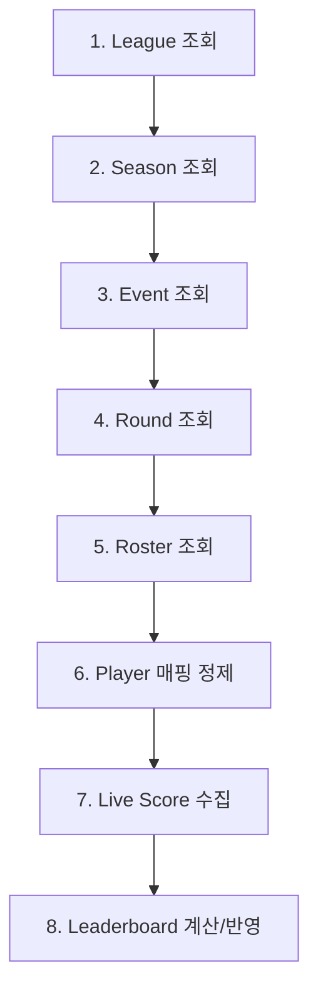
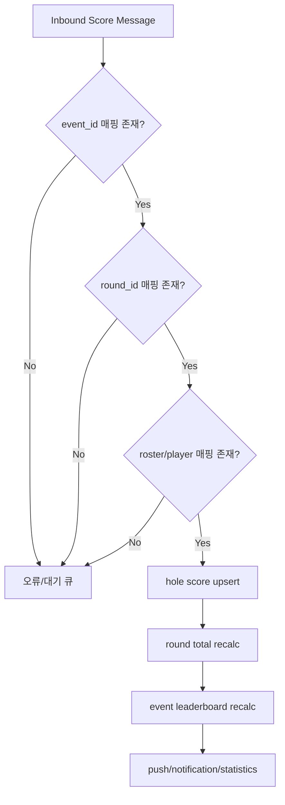
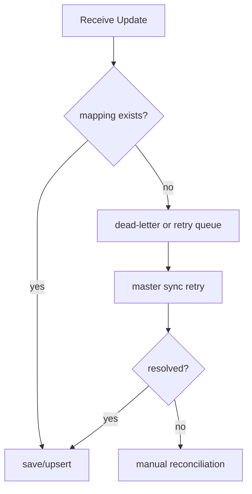
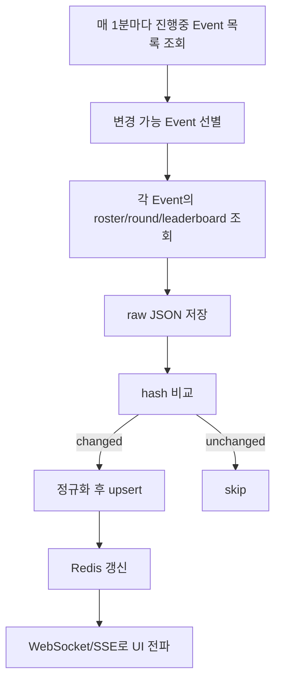

# 실전 구현 가이드

[← 동기화 전략](./sync-strategy.md) | [개요로 돌아가기 →](./index.md)

---

## Smartscore 연동용 매핑 모델

### 최소 매핑 단위

아래 ID 매핑 테이블을 별도로 두는 것이 좋다.

| Golf Genius ID | Smartscore ID |
|----------------|---------------|
| gg_league_id | smartscore_league_id |
| gg_season_id | smartscore_season_id |
| gg_event_id | smartscore_event_id |
| gg_round_id | smartscore_round_id |
| gg_player_id | smartscore_member_id |
| gg_roster_entry_id (or event-player composite) | smartscore_event_participant_id |

---

## 동기화 순서

이 순서를 추천하는 이유는, 점수보다 먼저 상위 식별자 계층이 안정적으로 매핑되어야 하기 때문이다.

---

## 실시간 수집 범위

### 우선 수집 대상
- in-progress Event
- 당일 Event
- 최근 변경된 Event

### 후순위 대상
- 종료된 Event 전체 재동기화
- 시즌 누적 포인트 재계산

---

## 점수 이벤트 저장 모델 예시

---

## Upsert 전략

실시간 점수는 정정이 자주 발생하므로, 단순 insert보다 아래 키 기준 **idempotent upsert**를 추천한다.

### 권장 유니크 키
- event_id
- round_id
- roster_entry_id
- hole_number
- score_type

### 이유
- 같은 홀 점수가 수정될 수 있음
- 네트워크 재전송/중복 수신 가능
- 모바일 입력 중 hole-by-hole 업데이트가 반복될 수 있음

---

## 멱등 키 권장

| 엔티티 | 멱등 키 |
|--------|---------|
| League | `external_league_id` |
| Season | `external_season_id` |
| Event | `external_event_id` |
| Player | `external_player_id` |
| Event Participant | `(external_event_id, external_player_id)` |
| Round | `external_round_id` |
| Scorecard | `(external_round_id, external_player_id)` 또는 vendor score id |

---

## 실패 처리 / 재처리

### 재처리 전략

1. raw JSON 저장
2. sync job history 기록
3. entity별 last success cursor 관리
4. 실패 엔터티만 재큐잉
5. 완전 재동기화 배치 별도 운영

---

## 가장 현실적인 1차 구현

---

## Smartscore 주의 포인트

### 1. Player와 Membership는 다를 수 있음

Golf Genius의 Player는 Smartscore 회원과 1:1이 아닐 수 있다.
외부 초청 선수, 게스트, 임시 등록 참가자가 있을 수 있다.

**대응:**
- member_id nullable 허용
- external_player_key 저장
- 중복 인물 병합 규칙 필요

### 2. Roster는 스냅샷 성격이 있을 수 있음

이벤트 시점의 핸디캡/디비전/팀 정보가 Player 마스터와 다를 수 있다.

**대응:**
- Player 마스터 값으로 덮어쓰지 말고
- Event Participant 테이블에 별도 보관

### 3. Season points는 League/Season 축에서 계산될 가능성이 높음

공개 제품 페이지에서 season points가 강조되므로, 점수 집계는 Event 단독이 아니라 Season 누적 컨텍스트를 가질 수 있다.

**대응:**
- Event 결과 저장
- Season aggregate 별도 저장
- 리더보드/포인트 테이블 분리

---

## 가장 중요한 실무 포인트

실시간 스코어 연동은 Player 중심이 아니라, 반드시 **Event + Round + Roster(Participant)** 문맥으로 설계해야 한다.

즉 Smartscore 내부 모델은 최소한 아래 3개를 분리하는 것이 좋다:

1. **Player Master**
2. **Event Participant (Roster Entry)**
3. **Score Fact (Round/Hole 단위)**

---

## 후속 산출물 (필요 시 생성 가능)

1. Smartscore 연동용 ERD 초안
2. Golf Genius → Smartscore 실시간 스코어 수신 API 스펙 초안
3. Webhook 미지원 가정 Polling 동기화 아키텍처 문서
4. 테이블 DDL 초안 (MySQL 기준)
5. Java/Spring Boot 연동 배치 및 Upsert 예제 코드

---

[← 동기화 전략](./sync-strategy.md) | [개요로 돌아가기 →](./index.md)
