# Golf Genius (GG) <-> Smartscore (SS) Integration Flow

**Document Purpose**: Step-by-step integration flow summary for GG-SS real-time score synchronization  
**Version**: 1.0  
**Date**: 2026-04-02

---

## Table of Contents

1. [Overview](#overview)
2. [System Context](#system-context)
3. [End-to-End Integration Flow](#end-to-end-integration-flow)
4. [Phase 1: Initial Setup & Configuration](#phase-1-initial-setup--configuration)
5. [Phase 2: Event Discovery & Webhook Registration](#phase-2-event-discovery--webhook-registration)
6. [Phase 3: Receiving Master Data via Webhooks](#phase-3-receiving-master-data-via-webhooks)
7. [Phase 4: Tablet Round Flow with GG Integration](#phase-4-tablet-round-flow-with-gg-integration)
8. [Phase 5: Real-Time Score Push (SS to GG)](#phase-5-real-time-score-push-ss-to-gg)
9. [Player Matching Strategy](#player-matching-strategy)
10. [Open Questions for GG](#open-questions-for-gg)

---

## Overview

### 1.1 Integration Goal

The primary goal of this integration is to **push real-time scores from SS tablets to GG** so that GG can provide tournament leaderboards, standings, and result services for events managed through GG.

### 1.2 Data Flow Direction

| Direction | Data | Method |
|-----------|------|--------|
| **GG -> SS** (Inbound) | Events, Roster, Pairings, Courses, Settings | Polling + Webhooks (Hybrid) |
| **SS -> GG** (Outbound) | Real-time scores | GG Score API (exact spec TBD by GG) |

---

## System Context

### 2.1 High-Level Architecture

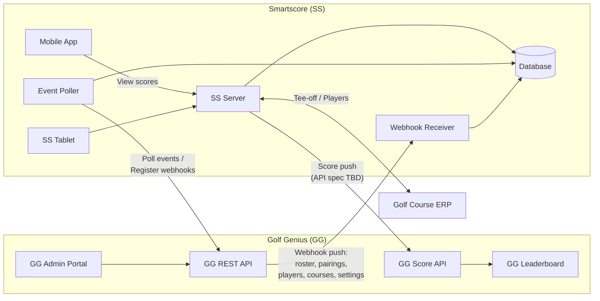

### 2.2 SS Tablet Round Flow (Existing)

To understand where the GG integration fits, here is the existing SS tablet round flow:

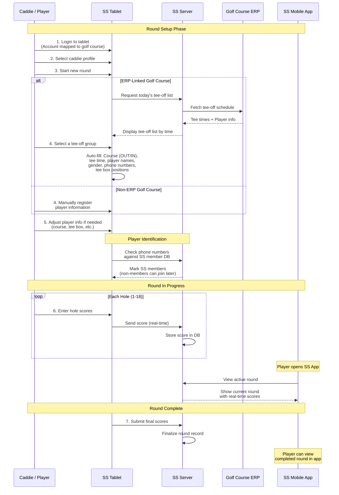

**Key Points**:
- The tablet account is pre-mapped to a specific golf course
- If the course has ERP integration, tee-off schedules are automatically loaded
- Players are identified by **phone number** (primary identifier in SS)
- Scores are transmitted in real-time, hole by hole
- Players can open the SS mobile app to see their active round and check current scores (pull-based, not push notification)
- Non-SS-members who provide a phone number can later register and claim their scores within a certain period

---

## End-to-End Integration Flow

### 3.1 Complete Integration Lifecycle

```mermaid
flowchart TD
    subgraph Phase1["Phase 1: Initial Setup"]
        A1[GG issues API Key<br/>per golf course]
        A2[SS Admin stores API Key<br/>in SS course config]
        A3[SS enables GG sync<br/>for the course]
    end

    subgraph Phase2["Phase 2: Event Discovery"]
        B1[SS Poller runs<br/>every 10 min]
        B2[GET /events<br/>from GG API]
        B3{New event<br/>detected?}
        B4[Register webhooks<br/>PUT /events/:id]
        B5[Store event<br/>in SS DB]
    end

    subgraph Phase3["Phase 3: Webhook Data"]
        C1[GG sends webhooks:<br/>courses, event_roster_members,<br/>pairings, players, settings]
        C5[SS stores all data<br/>in local DB]
    end

    subgraph Phase4["Phase 4: Tablet Round"]
        D1[Caddie / Player starts<br/>round on tablet]
        D2{Today's GG event<br/>exists?}
        D3[Show pairing list:<br/>tee time + roster names]
        D4[Caddie / Player selects<br/>a pairing group]
        D5[Match players:<br/>SS Member + GG Roster]
        D6[Begin round]
    end

    subgraph Phase5["Phase 5: Score Push"]
        E1[Caddie / Player enters<br/>hole score on tablet]
        E2{Player is<br/>SS Member +<br/>GG Roster?}
        E3[Push score to GG<br/>via Score API]
        E4[Round complete:<br/>Send full scorecard to GG]
        E5[GG Leaderboard<br/>updated]
    end

    A1 --> A2 --> A3
    A3 --> B1 --> B2 --> B3
    B3 -->|Yes| B4 --> B5
    B3 -->|No| B1
    B5 --> C1
    C1 --> C5
    C5 --> D1 --> D2
    D2 -->|Yes| D3 --> D4 --> D5 --> D6
    D2 -->|No| D6
    D6 --> E1 --> E2
    E2 -->|Yes| E3
    E2 -->|No| E1
    E3 --> E4 --> E5
```

### 3.2 Full Sequence Diagram

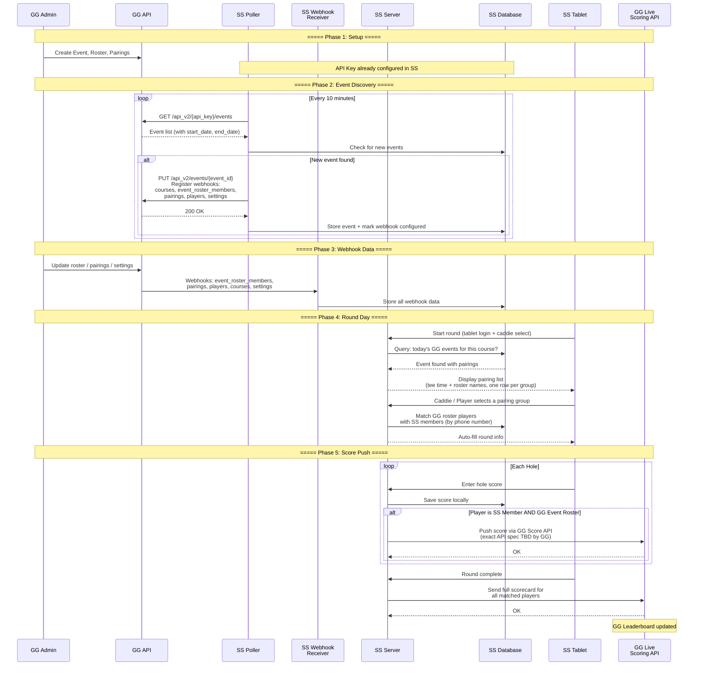

---

## Phase 1: Initial Setup & Configuration

### 4.1 Prerequisites

| Item | Responsible | Description |
|------|-------------|-------------|
| GG API Key | GG | Issued per golf course (Customer Center) |
| Webhook Integration Feature | GG | Must be enabled per customer (Admin Center > Edit > Product Versions) |
| SS Course Configuration | SS | Store API Key in SS database, enable GG sync |

### 4.2 Configuration Flow

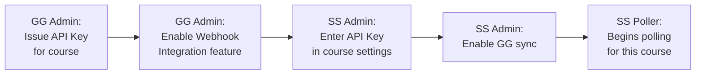

### 4.3 SS Database Configuration

SS stores the following per golf course:

| Field | Description |
|-------|-------------|
| `api_key` | GG API Key for this course |
| `webhook_types` | Which webhooks to register (default: courses, event_roster_members, pairings, players, settings) |
| `sync_enabled` | Whether GG sync is active |
| `score_push_enabled` | Whether to push scores to GG |

---

## Phase 2: Event Discovery & Webhook Registration

### 5.1 Event Polling Strategy

SS polls GG for new events at a **10-minute interval**. When a new event is detected, SS automatically registers webhooks for that event via the GG API.

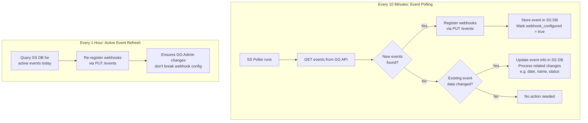

### 5.2 Webhook Types

| Webhook | Purpose | Default |
|---------|---------|---------|
| `courses` | Course layout changes (holes, pars, tees) | Enabled |
| `event_roster_members` | Players added/removed from event roster | Enabled |
| `pairings` | Pairing group changes (groups, tee times, player assignments) | Enabled |
| `settings` | Event/round setting changes | Enabled |
| `players` | Individual player profile changes (name, handicap) | Enabled |
| `scores` | Score changes (SS->GG direction, so disabled by default) | Optional |
| `matches` | Match play information | Optional |
| `match_results` | Match play results | Optional |
| `team_results` | Team competition results | Optional |
| `teams` | Team assignments | Optional |

### 5.3 Webhook Re-registration Strategy

| Trigger | Interval | Target |
|---------|----------|--------|
| New event detected | On detection (via 10-min poll) | New events only |
| Active event refresh | Every 1 hour | Events with today's rounds |
| Full re-sync | Once per day | All non-archived events |

> **Why re-register?** If a GG Admin manually modifies webhook settings through the GG Admin Portal, SS re-registration ensures webhook endpoints are always correctly configured.

---

## Phase 3: Receiving Master Data via Webhooks

### 6.1 Webhook Data Flow

Once webhooks are registered, GG pushes data to SS whenever changes occur in the event.

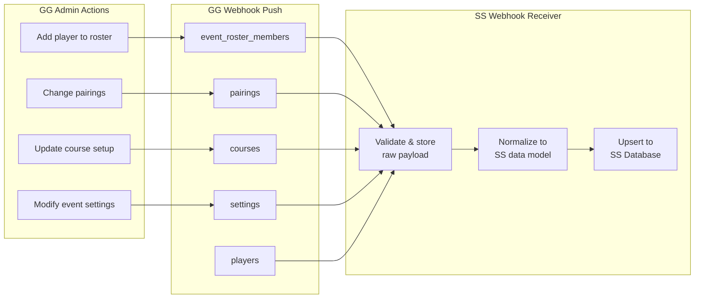

### 6.2 Key Data Received via Webhooks

#### Event Roster Members

Contains the list of players registered for the event:

| Field | Description |
|-------|-------------|
| `member_id` | GG Master Roster member ID |
| `first_name` / `last_name` | Player name |
| `email` | Player email (GG primary identifier) |
| `handicap_index` | Player handicap |
| `division_id` | Division assignment |
| `team_id` | Team assignment (if applicable) |
| `custom_fields` | May include phone number |

#### Pairings

Contains pairing groups (foursomes) with tee times:

| Field | Description |
|-------|-------------|
| `pairing_group_id` | Unique group ID |
| `tee_time` | Starting time (e.g., "08:00 AM") |
| `starting_hole` | Starting hole number (for shotgun starts) |
| `players[]` | Array of players in this group |
| `players[].roster_entry_id` | Player's roster entry ID (needed for score push) |
| `players[].player_round_id` | Player's round-specific ID |

#### Courses

Contains course layout information:

| Field | Description |
|-------|-------------|
| `course_id` | Course ID |
| `holes[]` | Hole definitions (par, yardage, handicap index) |
| `tees[]` | Tee box definitions |

### 6.3 SS Webhook Endpoints

All webhooks are received at:

```
Base URL: https://golf-genius.smartscore.kr/ss/gg/webhooks/
```

| Endpoint | Method | Purpose |
|----------|--------|---------|
| `/ss/gg/webhooks/courses` | POST | Course data changes |
| `/ss/gg/webhooks/event_roster_members` | POST | Roster member changes |
| `/ss/gg/webhooks/pairings` | POST | Pairing/tee-time changes |
| `/ss/gg/webhooks/settings` | POST | Event/round setting changes |
| `/ss/gg/webhooks/players` | POST | Player profile changes |

### 6.4 Webhook Processing Pipeline

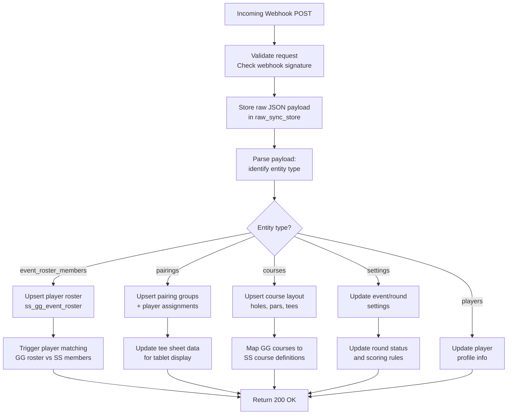

---

## Phase 4: Tablet Round Flow with GG Integration

### 7.1 Enhanced Tablet Flow

When a caddie or player starts a round on the tablet, if a GG event exists for today, the pairing data received via webhooks is presented as a selectable list.

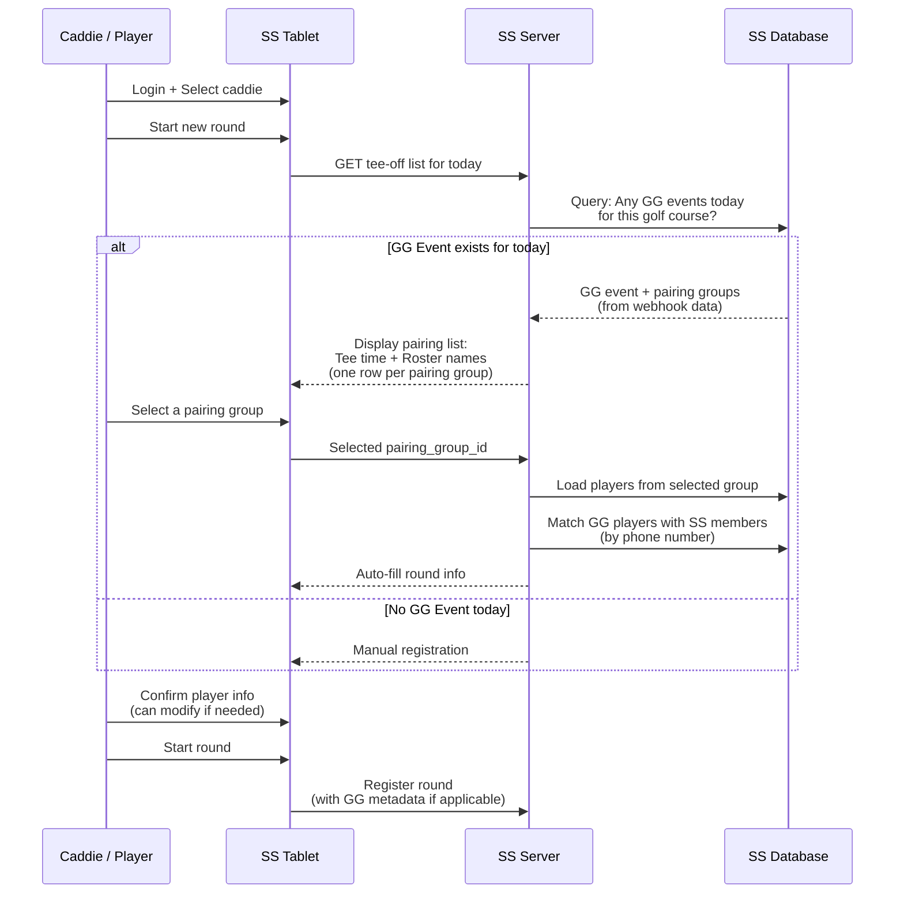

### 7.2 Data Source on Tablet

> **Note**: Whether the tablet displays the existing ERP tee-off list or the GG Event Roster list (or both) is **to be determined**. This decision will be made at a later stage.

The data displayed on the tablet for GG events is:
- **Tee-off time**
- **Roster player names**

Each pairing group is shown as **one row** in the list.

### 7.3 Tablet Display: GG Pairing List

When GG event data is available, the tablet shows a simple list:

```
┌──────────────────────────────────────────────────┐
│  08:00  |  Kim Cheolsu, Lee Younghee,            │
│            Park Minsu, Choi Jihoon               │
├──────────────────────────────────────────────────┤
│  08:10  |  Jung Sumin, Kang Daeun,               │
│            Yoon Seojun, Han Jiwoo                │
├──────────────────────────────────────────────────┤
│  08:20  |  Hong Gildong, Seo Jiyeon,             │
│            Cho Minho, Baek Dahye                 │
├──────────────────────────────────────────────────┤
│  ...                                             │
└──────────────────────────────────────────────────┘
```

---

## Phase 5: Real-Time Score Push (SS to GG)

### 8.1 Score Push Eligibility

Scores are pushed to GG only when **both conditions** are met:

1. The player is an **SS Member** (identified by phone number in SS)
2. The player is matched to a **GG Event Roster entry** (matched by phone number)

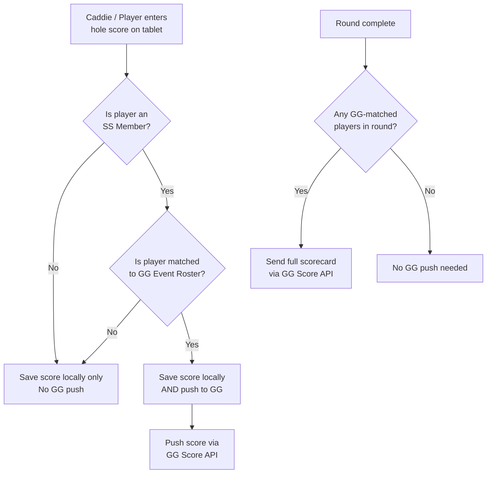

### 8.2 Score Push API

> **Note**: The exact Score API specification (endpoints, request/response format, required identifiers) is **to be provided by GG**. Once GG confirms the final API spec, SS will implement the score push accordingly.
>
> **Expected capabilities**:
> - Real-time score push (hole-by-hole or batch) during a round
> - Full scorecard submission on round completion
> - Required identifiers: event ID, round ID, player/roster entry ID, hole number, strokes, etc.

### 8.3 Score Push Flow Diagram

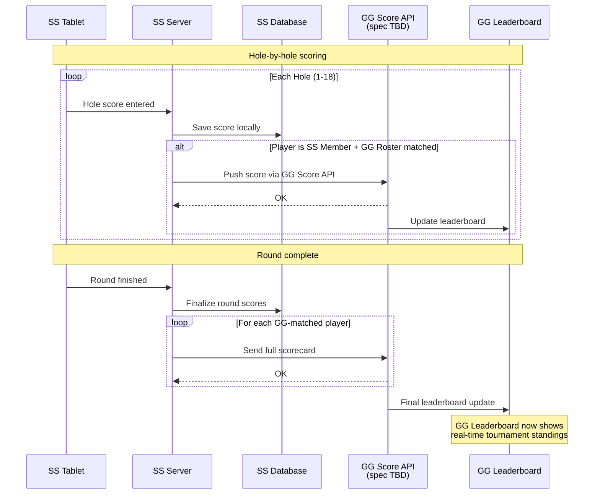

### 8.4 Network Failure Handling for Score Push

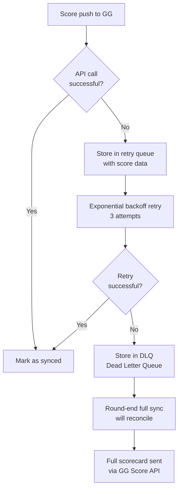

---

## Player Matching Strategy

### 9.1 The Matching Challenge

GG and SS use **different primary identifiers**:

| System | Primary Identifier | Notes |
|--------|-------------------|-------|
| **GG** | Email | Phone number is not a default field; can only be added via `custom_fields` |
| **SS** | Phone number | SS authenticates members via phone number verification. Email is not currently supported for matching. |

This difference is a **critical integration challenge**. SS relies exclusively on phone numbers for member identification, but GG does not have phone number as a standard field.

### 9.2 Matching Flow

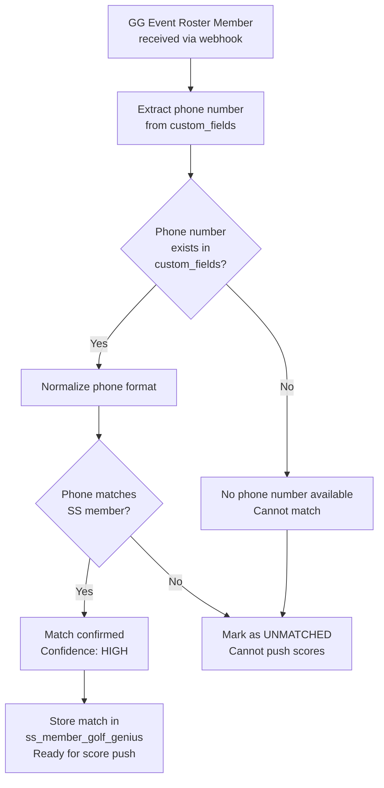

### 9.3 Match Priority

| Priority | Method | Confidence | Auto-match? |
|----------|--------|------------|-------------|
| 1st | Phone number (from `custom_fields`) | High | Yes |
| - | No phone number available | - | Cannot match; scores not pushed to GG |

### 9.4 Identifier Notes

- SS authenticates all members via **phone number verification** at sign-up
- SS tablets identify players by **phone number** during round registration
- GG does not include phone number as a default player field; it is only available via `custom_fields`
- Phone format normalization is required before matching (e.g., `010-1234-5678` vs `01012345678`)
- Once matched, the mapping is stored persistently and reused across events
- **This matching strategy depends on GG providing a reliable, standardized phone number field** (see Open Questions)

---

## Open Questions for GG

The following items require clarification from the GG team to finalize the integration design:

### Webhooks

| # | Question | Context |
|---|----------|---------|
| 1 | What is GG's webhook retry policy on delivery failure? | To understand the overlap with SS polling |
| 2 | Does the `players` webhook fire only for event-scoped players or all master roster changes? | Determines whether SS needs separate master roster polling |

### Score API

| # | Question | Context |
|---|----------|---------|
| 3 | What is the complete Score API specification (endpoints, request/response format)? | SS needs the final spec to implement score push |

### Player Matching (Phone Number)

| # | Question | Context |
|---|----------|---------|
| 4 | SS authenticates members via phone number verification and uses phone numbers to identify players on tablets during rounds. However, GG's default player profile does not include a phone number field — it can only be added via `custom_fields`. When registering players to the event roster, is there a way to make phone number a **required field** with a **standardized field name** (e.g., `mobile_no`)? Since `custom_fields` allows free-form naming, different courses could use different field names (e.g., "Phone Number", "Cell Phone", "Mobile"), making it impossible for SS to reliably extract the phone number programmatically. | Phone number is the **only** identifier SS can use for player matching. Without a consistent, required phone number field, SS cannot match GG roster members to SS members and therefore cannot push scores to GG. |

### Course Mapping

| # | Question | Context |
|---|----------|---------|
| 5 | On the SS tablet, players select a **Front 9 course (OUT)**, **Back 9 course (IN)**, and optionally an **Additional 9-hole course** when starting a round. SS manages courses as individual 9-hole units. For example, if a golf course has 27 holes with three 9-hole courses named "South", "East", and "West", SS needs to map the GG Course ID for each course to the corresponding SS internal course ID. SS plans to store the **Course ID generated by GG upon course registration** and map it to the SS course ID. This mapping is necessary because when `pairings` webhook data is received, SS needs to determine which SS course corresponds to the GG course in the pairing group, so the tablet can correctly auto-fill the OUT/IN course selection. Is the Course ID from GG's course registration the correct identifier to use for this mapping? | SS manages courses as 9-hole units (OUT/IN/Additional). Each golf course typically has 2-3 nine-hole courses. The `pairings` webhook includes course information, and SS must map it to internal course IDs so the tablet can auto-fill the correct course when a pairing group is selected. |
