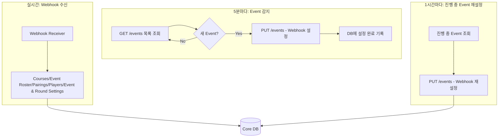
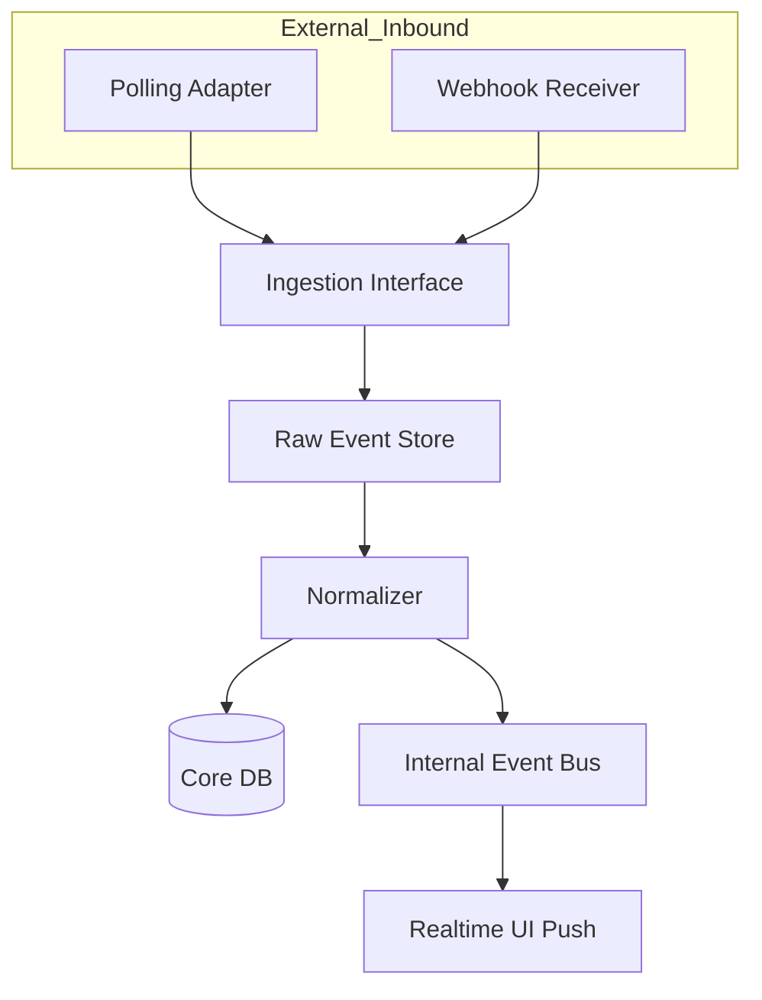
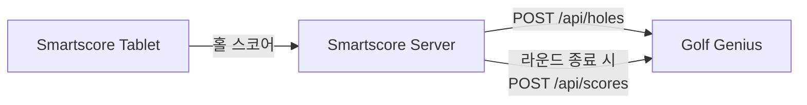

# 동기화 전략: Hybrid (Polling + Webhook)

[← 시스템 아키텍처](./architecture.md) | [다음: 구현 가이드 →](./implementation-guide.md)

---

## 현재 확인된 연동 방식

Golf Genius는 **Webhook과 Polling 모두 지원**한다.

| 항목 | 상태 |
|------|------|
| Webhook 존재 여부 | ✅ **확인됨** (10가지 webhook 지원) |
| Polling 기반 연동 | ✅ 가능 |
| 적용 방식 | **Hybrid: Polling으로 Event 감지 + API로 Webhook 자동 설정** |

### 사용 가능한 Webhook 종류 (10가지)

| Webhook | 용도 |
|---------|------|
| `courses` | 코스 정보 변경 |
| `pairings` | 조 편성 변경 |
| `players` | 이벤트 참가 플레이어 프로필 변경 (이름, 핸디캡 등) |
| `scores` | 스코어 변경 |
| `settings` | 이벤트/라운드 설정 변경 |
| `matches` | 매치 정보 |
| `match_results` | 매치 결과 |
| `team_results` | 팀 결과 |
| `teams` | 팀 정보 |
| `event_roster_members` | 이벤트 로스터 멤버 |

---

## Webhook vs Polling 비교표

| 항목 | Webhook | Polling |
|---|---|---|
| 지연 시간 | 매우 짧음 | 주기 의존 |
| 구현 난이도 | 중간 | 낮음 |
| 외부 시스템 의존성 | 높음 | 낮음 |
| 재처리/복구 | 별도 설계 필요 | 상대적으로 쉬움 |
| 누락 위험 | 서명/재시도 설계에 따라 다름 | cursor/hash로 통제 쉬움 |
| 운영 예측성 | 외부 push 정책에 영향 | 우리 쪽에서 통제 가능 |
| Golf Genius 지원 | ✅ 10가지 webhook | ✅ API 공개 |

---

## Hybrid 전략 선택 이유

1. **Webhook 설정 자동화**: API를 통해 Event별 Webhook을 프로그래밍 방식으로 설정 가능
2. **실시간성 확보**: Webhook으로 변경 사항 즉시 수신
3. **안정성 유지**: Polling으로 누락 방지 및 정합성 보장
4. **운영 효율성**: 골프장 관리자가 수동으로 Webhook 설정할 필요 없음

---

## 연동 방식: Hybrid (Polling + Webhook 자동 설정)

### 전체 흐름



### Webhook 자동 설정 API

Event 생성/수정 API를 통해 Webhook을 프로그래밍 방식으로 설정할 수 있다.

```http
PUT /api_v2/events/{event_id}
Authorization: Bearer {api_key}
Content-Type: application/json

{
  "webhooks": {
    "courses": {
      "endpoint": "https://golfgenius.smartscore.kr/ss/gg/webhooks/courses",
      "enabled": true
    },
    "event_roster_members": {
      "endpoint": "https://golfgenius.smartscore.kr/ss/gg/webhooks/event_roster_members",
      "enabled": true
    },
    "pairings": {
      "endpoint": "https://golfgenius.smartscore.kr/ss/gg/webhooks/pairings",
      "enabled": true
    },
    "settings": {
      "endpoint": "https://golfgenius.smartscore.kr/ss/gg/webhooks/settings",
      "enabled": true
    }
  }
}
```

### 골프장별 Webhook 설정

각 골프장의 요구사항에 따라 활성화할 Webhook 종류를 다르게 설정할 수 있다.

#### 기본 Webhook (4가지)

| Webhook | 용도 | 기본값 |
|---------|------|--------|
| `courses` | 코스 정보 변경 | ✅ 활성화 |
| `event_roster_members` | 이벤트 참가자 명단 변경 (추가/삭제) | ✅ 활성화 |
| `pairings` | 조 편성 변경 | ✅ 활성화 |
| `settings` | 이벤트/라운드 설정 변경 | ✅ 활성화 |

#### 선택적 Webhook

| Webhook | 용도 | 비고 |
|---------|------|------|
| `players` | 개별 플레이어 프로필 변경 (이름, 핸디캡 등) | 필요 시 활성화 |
| `scores` | 스코어 변경 | SS→GG 단방향이므로 기본 비활성화 |
| `matches` | 매치 정보 | 필요 시 활성화 |
| `match_results` | 매치 결과 | 필요 시 활성화 |
| `team_results` | 팀 결과 | 필요 시 활성화 |
| `teams` | 팀 정보 | 필요 시 활성화 |

> **참고**: `players`는 개별 플레이어 프로필 정보 변경 시 발생하며, `event_roster_members`는 이벤트에 참가자가 추가/삭제될 때 발생한다.

> **`players` webhook 범위 (Golf Genius 확인 필요)**
> - Webhook은 Event 단위로 설정되므로, `players` webhook은 **해당 Event에 참가한 플레이어**의 프로필 변경 시에만 발생할 가능성이 높음
> - **Master Roster**(클럽 전체 회원 풀)의 프로필 변경은 webhook이 아닌 Polling 방식으로 감지한다
>   - `GET /api_v2/{api_key}/master_roster` API 주기적 조회 (30분~1시간 주기)
>   - 응답 JSON 해시 비교로 변경 감지
> - 정확한 동작은 Golf Genius 측에 확인 필요

> **사전 조건**: Webhook Integration 기능이 해당 Customer(골프장)에 활성화되어 있어야 함
> (Admin Center > Edit > Product Versions)

---

## Hybrid Architecture



핵심은 `Polling Adapter`와 `Webhook Receiver`가 같은 `Ingestion Interface`로 들어오도록 만드는 것이다.

---

## Sync Worker 구현 전략

### 5분마다: 새 Event 감지 + Webhook 설정

```python
# 기본 Webhook 설정 (4가지)
DEFAULT_WEBHOOKS = ["courses", "event_roster_members", "pairings", "settings"]

def get_course_webhook_config(course_id):
    """골프장별 Webhook 설정 조회 (DB에서 설정된 값 또는 기본값)"""
    config = db.query(
        "SELECT webhook_types FROM golf_course_gg_config WHERE golf_course_id = ?",
        course_id
    )
    if config and config.webhook_types:
        return json.loads(config.webhook_types)
    return DEFAULT_WEBHOOKS

def build_webhook_payload(course_id):
    """골프장별 Webhook 설정 payload 생성"""
    webhook_types = get_course_webhook_config(course_id)
    webhooks = {}
    for wh_type in webhook_types:
        webhooks[wh_type] = {
            "endpoint": f"{WEBHOOK_BASE_URL}/{wh_type}",
            "enabled": True
        }
    return webhooks

def sync_new_events():
    for course in linked_courses:
        # 1. Event 목록 조회
        events = gg_api.get_events(course.api_key)

        # 2. DB에서 이미 설정된 event_id 조회
        configured_ids = db.query(
            "SELECT event_id FROM webhook_configured_events WHERE golf_course_id = ?",
            course.id
        )

        # 3. 새 Event만 필터링
        new_events = [e for e in events if e.id not in configured_ids]

        # 4. 새 Event만 Webhook 설정 (골프장별 설정 적용, Idempotent)
        for event in new_events:
            gg_api.update_event(
                event_id=event.id,
                webhooks=build_webhook_payload(course.id)
            )

            # 5. DB에 기록
            db.insert("webhook_configured_events", {
                "event_id": event.id,
                "golf_course_id": course.id,
                "configured_at": now()
            })
```

### 1시간마다: 진행 중 Event Webhook 재설정

GG Admin에서 수동으로 Webhook 설정을 변경한 경우를 대비하여 진행 중인 Event만 주기적으로 재설정한다.

```python
def refresh_active_webhooks():
    today = date.today()
    for course in linked_courses:
        events = gg_api.get_events(course.api_key)

        # 오늘 라운드가 있는 Event만 대상
        active_events = [
            e for e in events
            if e.start_date <= today <= e.end_date
        ]

        for event in active_events:
            configure_webhook(event)  # Idempotent하므로 중복 호출 무해
```

### 전략 B. 상태 기반 빈도 조정

| 이벤트 상태 | Polling 주기 |
|-------------|--------------|
| `IN_PROGRESS` | 30초 |
| `SCHEDULED_TODAY` | 5분 |
| `COMPLETED_TODAY` | 10분 |
| `HISTORICAL` | 24시간 |

### Master Roster Polling (선택적)

Master Roster는 Event 범위 밖의 클럽 전체 회원 풀이므로 Webhook이 아닌 Polling으로 변경을 감지한다.

```python
def sync_master_roster():
    """30분~1시간마다: Master Roster 동기화"""
    for course in linked_courses:
        roster = gg_api.get_master_roster(course.api_key)

        # 해시 비교로 변경 감지
        current_hash = hash_json(roster)
        last_hash = db.query(
            "SELECT hash FROM master_roster_sync WHERE golf_course_id = ?",
            course.id
        )

        if current_hash != last_hash:
            # 변경된 멤버 동기화
            for member in roster:
                db.upsert("master_roster", {
                    "gg_member_id": member.id,
                    "golf_course_id": course.id,
                    "name": member.name,
                    "handicap": member.handicap,
                    "email": member.email,
                    "updated_at": now()
                })

            # 해시 기록
            db.upsert("master_roster_sync", {
                "golf_course_id": course.id,
                "hash": current_hash,
                "synced_at": now()
            })
```

---

## Event 조회 API 제약사항

### 필터 조건

```
GET /api_v2/{api_key}/events?page={page}&season={season_id}&category={category_id}&directory={directory_id}&archived={archived}
```

| 파라미터 | 지원 여부 | 설명 |
|----------|----------|------|
| `page` | ✅ | 100개씩 페이지네이션 |
| `season` | ✅ | Season ID로 필터 |
| `category` | ✅ | Category ID로 필터 |
| `directory` | ✅ | Directory ID로 필터 |
| `archived` | ✅ | 보관된 Event만 조회 |
| `start_date` / `end_date` | ❌ | **날짜 기반 필터 없음** |

### 중요 제약사항

| 항목 | 상태 |
|------|------|
| 날짜 기반 필터 | ❌ API에 없음, 클라이언트 필터링 필요 |
| Webhook 상태 조회 | ❌ GET 응답에 포함 안 됨 |
| 개별 Event 조회 API | ❌ 없음 (목록 조회만 가능) |

응답의 `start_date`, `end_date` 필드로 클라이언트 측에서 필터링해야 한다.

---

## Rate Limit

> **문서에 구체적인 Rate Limit 명시 없음** - Golf Genius 측에 확인 필요

### 적용 방식

```python
from ratelimit import limits, sleep_and_retry

# 보수적 기본값: 분당 60회 (초당 1회)
CALLS_PER_MINUTE = 60

@sleep_and_retry
@limits(calls=CALLS_PER_MINUTE, period=60)
def call_gg_api(endpoint, **kwargs):
    return requests.get(endpoint, **kwargs)
```

### API 호출량 예상 (1,000 골프장 기준)

| 작업 | 주기 | 호출 수 |
|------|------|---------|
| Event 목록 조회 | 5분 | 1,000 GET |
| 새 Event Webhook 설정 | 5분 | ~10 PUT |
| 진행 중 Event 재설정 | 1시간 | ~1,000 PUT |
| 전체 Event 재설정 | 하루 1회 | ~5,000 PUT |

### Golf Genius 확인 필요 사항

1. API Rate Limit 상세 (요청 수, 적용 단위)
2. Rate Limit 초과 시 응답 형식 (HTTP 429?)
3. Enterprise 연동 시 한도 상향 가능 여부
4. Webhook Integration 기능 일괄 활성화 방법

---

## 적용 방식 정리

### 채택 방식: Hybrid (Polling + Webhook 자동 설정)

```
┌─────────────────────────────────────────────────────────────────────┐
│  외부 연동                                                          │
│  • Polling: Event 감지, 마스터 데이터 동기화                         │
│  • Webhook: 실시간 변경 수신 (Course, Event Roster, Pairings, Event & Round Settings 등)          │
│  • API 자동 설정: 새 Event에 Webhook 자동 등록                       │
├─────────────────────────────────────────────────────────────────────┤
│  내부 처리                                                          │
│  • Kafka + Redis + SSE/WebSocket                                   │
│  • Raw 저장 + Normalizer + Core DB                                 │
└─────────────────────────────────────────────────────────────────────┘
```

### 장점

| 항목 | 설명 |
|------|------|
| 골프장 부담 없음 | 관리자는 이벤트만 생성, Webhook 설정은 자동 |
| 실시간성 확보 | 초기 설정 후에는 Webhook으로 즉시 수신 |
| 누락 방지 | Polling이 기본이라 Webhook 실패해도 복구 가능 |
| 확장성 | 10,000개 골프장이어도 중앙에서 일괄 관리 |

### 배제 방식
- 외부 Webhook만 믿고 raw 저장 없이 바로 반영하는 방식은 사용하지 않는다.
- **이유**: 재처리/역추적/부분 유실 대응이 어렵다.

---

## Outbound 동기화: Smartscore → Golf Genius

스마트스코어에서 제공하는 태블릿에 스코어 입력 시 **Outbound(SS→GG) 스코어 전송**을 한다.

### 스코어 전송 전략

| 시점 | 전송 방식 | 내용 |
|------|----------|------|
| 홀 완료 시 | 실시간 Push | 해당 홀 스코어 |
| 라운드 종료 시 | 전체 재전송 | 확정 스코어 |

### 스코어 전송 흐름

```
Tablet → SS Server → GG Server
```

1. **Tablet → SS Server**: 홀 완료 시 스코어를 Smartscore Server로 전송
2. **SS Server → GG Server**: Smartscore Server가 Golf Genius API로 스코어 Push
3. **라운드 종료 시**: 전체 스코어 재전송으로 정합성 보장

### Outbound 흐름 다이어그램



### Score API

Golf Genius Live Scoring API를 통해 스코어를 전송한다.

| API | 용도 | 시점 |
|-----|------|------|
| `POST /api/holes` | 홀별 실시간 전송 | 홀 완료 시 |
| `POST /api/scores` | 전체 스코어 전송 | 라운드 종료 시 |

**상세 스펙**: [Live Scoring API 문서](../api/live-scoring-api.md) 참조

---

## 운영 원칙

Hybrid 전략(Polling + Webhook)을 안정적으로 운영하기 위한 원칙:

1. **마스터 동기화 배치**: Event/Roster 주기적 동기화 (5분)
2. **Webhook 자동 설정**: 새 Event 감지 시 PUT API로 Webhook 자동 설정
3. **진행 중 Event 재설정**: 1시간마다 진행 중 Event Webhook 재설정 (GG Admin 변경 대응)
4. **Idempotent Upsert**: 중복 수신 대비
5. **Raw 저장**: Webhook payload 원본 저장 (재처리/분석용)
6. **DLQ 구현**: 처리 실패 메시지 보관 및 재처리

---

## DB 스키마 (Webhook 설정 추적)

### 골프장별 GG 연동 설정

```sql
CREATE TABLE golf_course_gg_config (
    id BIGINT AUTO_INCREMENT PRIMARY KEY,
    golf_course_id INT NOT NULL,
    api_key VARCHAR(100) NOT NULL,
    webhook_types JSON DEFAULT '["courses", "event_roster_members", "pairings", "settings"]',
    enabled TINYINT(1) DEFAULT 1,
    created_at TIMESTAMP DEFAULT CURRENT_TIMESTAMP,
    updated_at TIMESTAMP DEFAULT CURRENT_TIMESTAMP ON UPDATE CURRENT_TIMESTAMP,
    UNIQUE KEY uk_golf_course (golf_course_id)
) COMMENT '골프장별 Golf Genius 연동 설정';
```

### 이벤트별 Webhook 설정 추적

```sql
CREATE TABLE webhook_configured_events (
    id BIGINT AUTO_INCREMENT PRIMARY KEY,
    event_id VARCHAR(22) NOT NULL,
    golf_course_id INT NOT NULL,
    configured_at TIMESTAMP NOT NULL,
    last_refreshed_at TIMESTAMP,
    webhook_types JSON,  -- 실제 설정된 webhook 종류
    created_at TIMESTAMP DEFAULT CURRENT_TIMESTAMP,
    updated_at TIMESTAMP DEFAULT CURRENT_TIMESTAMP ON UPDATE CURRENT_TIMESTAMP,
    UNIQUE KEY uk_event_course (event_id, golf_course_id)
) COMMENT '이벤트별 Webhook 설정 이력';
```

---

[← 시스템 아키텍처](./architecture.md) | [다음: 구현 가이드 →](./implementation-guide.md)
