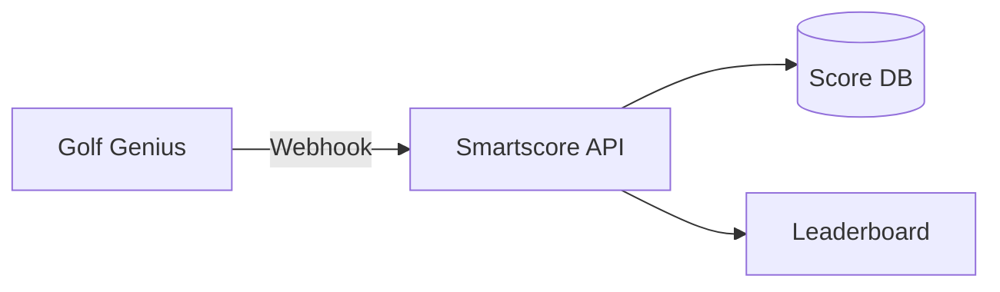
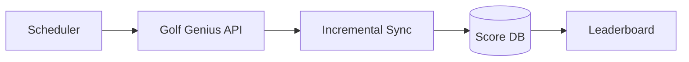
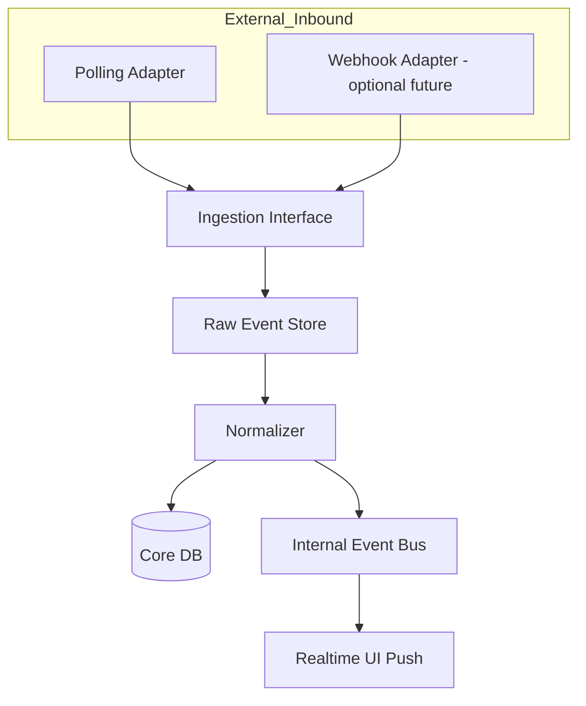

# 동기화 전략: Webhook vs Polling

[← 시스템 아키텍처](./architecture.md) | [다음: 구현 가이드 →](./implementation-guide.md)

---

## 현재 공개 자료 기준 판단

공개 접근 가능한 Golf Genius 자료에서는 API 문서, 리그/제품 소개, 가이드, 인증 프로그램, 웨비나, 제품 업데이트는 확인되지만, **외부 시스템에 Event/Round/Roster 변경을 push하는 일반 webhook 문서**는 명확히 확인되지 않았다.

따라서 현 시점의 기술 판단:

| 항목 | 상태 |
|------|------|
| Webhook 존재 여부 | 미확인 |
| Polling 기반 연동 | 확실히 가능 |
| 권장 기본안 | **Polling-first 설계, webhook-ready 인터페이스** |

---

## Webhook vs Polling 비교표

| 항목 | Webhook | Polling |
|---|---|---|
| 지연 시간 | 매우 짧음 | 주기 의존 |
| 구현 난이도 | 중간 | 낮음 |
| 외부 시스템 의존성 | 높음 | 낮음 |
| 재처리/복구 | 별도 설계 필요 | 상대적으로 쉬움 |
| 누락 위험 | 서명/재시도 설계에 따라 다름 | cursor/hash로 통제 쉬움 |
| 운영 예측성 | 외부 push 정책에 영향 | 우리 쪽에서 통제 가능 |
| Golf Genius 공개근거 | 명확치 않음 | API 공개 존재 |

---

## Polling을 권장하는 이유

1. 공개적으로 확인되는 가장 확실한 연동 수단이 API다.
2. Golf Genius는 live scoring과 leaderboards를 강하게 제공하지만, 그 자체가 곧 외부 webhook 공개를 뜻하지는 않는다.
3. 운영상 누락/순서 꼬임/재동기화를 고려하면 polling이 더 예측 가능하다.
4. Smartscore처럼 내부 시스템이 크고 다운스트림이 많은 경우, 외부 push에 바로 의존하기보다 수집 계층을 두는 편이 안전하다.

---

## 연동 방식 2가지

### A. Push/Webhook 가능할 때 (이상적)

### B. Webhook이 없을 때 (현실적)

Event/Round 단위 증분 Polling이 필요하다.

---

## Hybrid Ready Architecture

지금은 Polling으로 운영하되, 나중에 webhook이 생기면 쉽게 붙일 수 있도록 아래처럼 추상화한다.

핵심은 `Polling Adapter`와 `Webhook Adapter`가 같은 `Ingestion Interface`로 들어오도록 만드는 것이다.

---

## Polling 설계 디테일

### 전략 A. 이벤트 우선 탐색

1. 최근/진행중 이벤트 목록 확인
2. 이벤트별 roster/round/scores 상세 조회
3. 해시 비교 후 바뀐 것만 반영

### 전략 B. 상태 기반 빈도 조정

| 이벤트 상태 | Polling 주기 |
|-------------|--------------|
| `IN_PROGRESS` | 30초 |
| `SCHEDULED_TODAY` | 5분 |
| `COMPLETED_TODAY` | 10분 |
| `HISTORICAL` | 24시간 |

### 전략 C. 화면 중심 최적화

- 실시간 화면은 leaderboard endpoint 위주
- 정합성 동기화는 roster + round + score 상세 재검증

---

## Webhook 추후 전환 방법

webhook이 추후 가능해질 때의 전환 방법:

1. 외부 서명 검증 추가
2. payload 원본 저장
3. webhook 수신 즉시 event_id만 큐에 발행
4. 최종 정합성은 여전히 API pull로 보강

즉, webhook이 생겨도 "payload를 맹신해서 바로 DB 반영"보다 **webhook-triggered polling**이 더 안전하다.

---

## 권장안 정리

### 추천 1안 (가장 안정적)
- **외부**: Polling only
- **내부**: Kafka + Redis + SSE/WebSocket
- **용도**: 가장 안정적, 구현 예측 가능

### 추천 2안 (향후 확장성)
- **외부**: Polling + future webhook trigger
- **내부**: 동일
- **용도**: 향후 확장성 확보

### 비추천안
- 외부 webhook만 믿고 raw 저장 없이 바로 반영
- **이유**: 재처리/역추적/부분 유실 대응이 어렵다.

---

## 실무 권장사항

Webhook 지원 여부가 불명확한 동안에는 초기 버전을 아래처럼 설계하는 것이 안전하다:

1. **마스터 동기화 배치**: League/Season/Event/Roster 주기적 동기화
2. **라운드 진행 중 고빈도 Polling**: 진행 중 Event만 짧은 주기로 동기화
3. **Idempotent Upsert**: 중복 수신 대비
4. **변경 시각 기준 증분 수집** 또는 **스코어 전체 snapshot + diff 계산**

---

[← 시스템 아키텍처](./architecture.md) | [다음: 구현 가이드 →](./implementation-guide.md)
