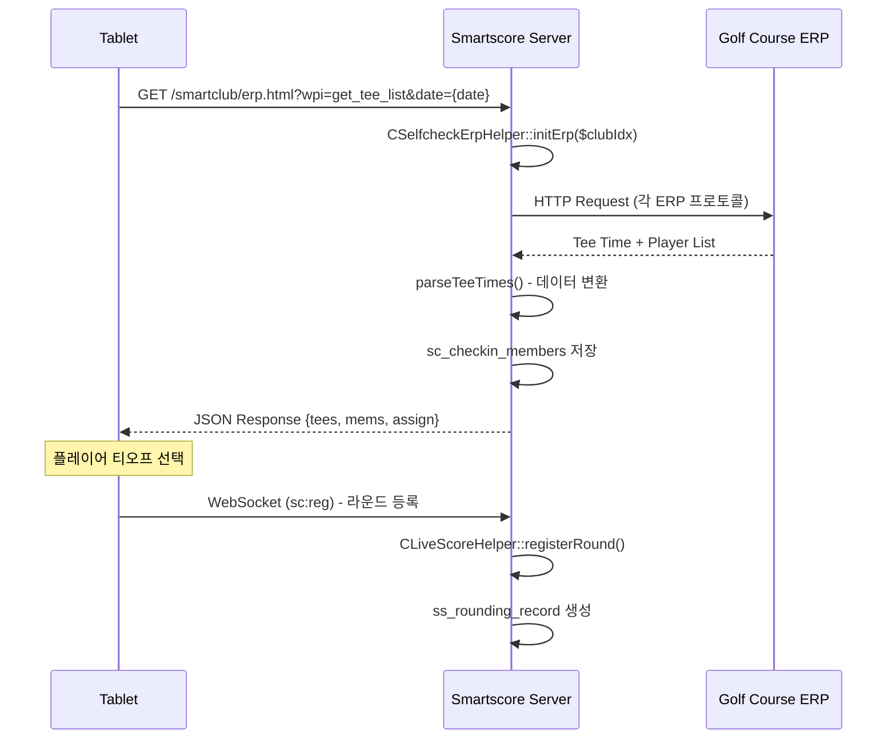
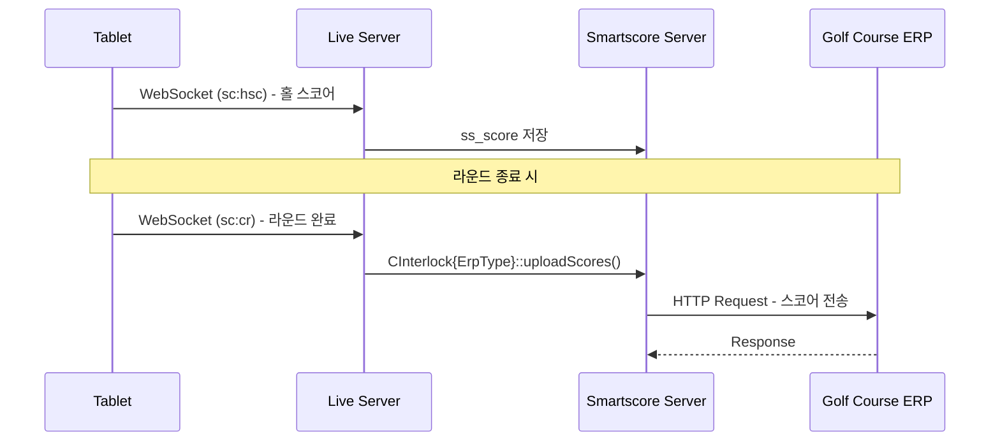
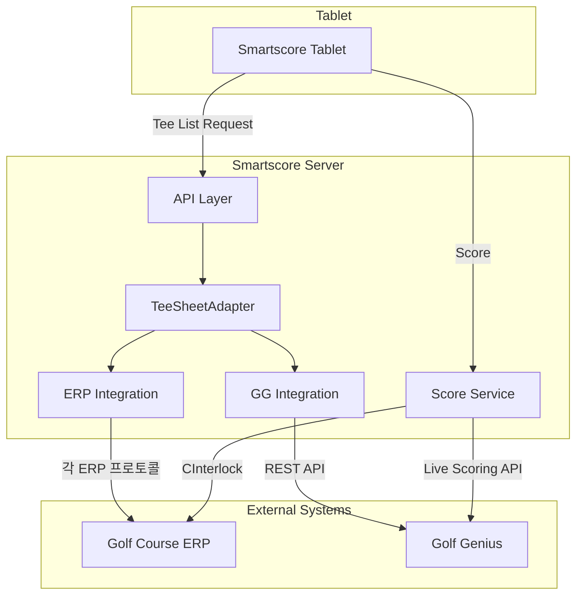

# GG Tee Sheet 연동 설계서

작성일: 2026-03-08

---

## 목차

1. [개요](#개요)
2. [현재 ERP 연동 아키텍처 분석](#현재-erp-연동-아키텍처-분석)
3. [데이터 흐름 분석](#데이터-흐름-분석)
4. [GG Tee Sheet 연동 시나리오](#gg-tee-sheet-연동-시나리오)
5. [설계 방안](#설계-방안)
6. [구현 상세](#구현-상세)
7. [데이터베이스 스키마](#데이터베이스-스키마)
8. [API 설계](#api-설계)
9. [테스트 시나리오](#테스트-시나리오)

---

## 개요

### 배경

현재 Smartscore는 약 400개의 골프장 ERP와 연동하여 당일 티오프 및 플레이어 정보를 태블릿에 제공하고 있다. Golf Genius(GG) 연동 시, GG에서 제공하는 Tee Sheet(조 편성) 정보를 활용하여 태블릿에서 라운드를 시작할 수 있어야 한다.

### 대상 시나리오

| 시나리오 | 설명 | 데이터 소스 |
|---------|------|------------|
| **ERP Only** | 기존 ERP만 사용하는 골프장 | 골프장 ERP 시스템 |
| **GG Only** | ERP 없이 GG만 사용하는 골프장 | Golf Genius API |
| **ERP + GG** | ERP와 GG 모두 사용하는 골프장 | 양쪽 모두 (우선순위 또는 병합) |

### 핵심 요구사항

1. 태블릿에서 당일 티오프 리스트를 조회할 수 있어야 함
2. 플레이어가 티오프를 선택하여 라운드를 시작할 수 있어야 함
3. ERP/GG 중 하나만 사용하거나 둘 다 사용하는 경우를 유연하게 지원
4. 라운드 종료 시 스코어를 GG로 전송

---

## 현재 ERP 연동 아키텍처 분석

### 핵심 클래스 구조

```
lib/class/
├── Booking/
│   ├── CBookingErpHelper.php        # ERP 헬퍼 (Factory)
│   ├── CBookingErpConn.php          # ERP 연결 추상 클래스
│   ├── CBookingErp{ErpType}.php     # 각 ERP별 구현 (60+ 개)
│   └── ...
├── Selfcheck/
│   ├── CSelfcheckErpHelper.php      # Selfcheck ERP 헬퍼
│   ├── CSelfcheckHelper.php         # Selfcheck 비즈니스 로직
│   ├── CSelfcheck{Club}.php         # 골프장별 ERP 구현
│   └── ...
├── Interlock/
│   ├── CInterlockAbs.php            # 양방향 연동 추상 클래스
│   ├── CInterlock{ErpType}.php      # 각 ERP별 양방향 연동
│   └── ...
├── Service/
│   ├── CServiceScore.php            # 라이브서버 스코어 서비스
│   └── ...
└── Live/
    └── CLiveScoreHelper.php         # 라이브 스코어 헬퍼
```

### ERP 연결 Factory 패턴

**CBookingErpHelper.php** (라인 26-40):
```php
public static function createErpConByType($club, $isDebug = false){
    $erpConn = null;
    $className = "CBookingErp{$club['erp_type']}";

    if(empty($club['erp_type']) ||
        ($club['erp_sync'] != 1 && !$isDebug) ||
        $club['erp_type'] == 'HKK') {
        return null;
    }
    else {
        $erpConn = new $className($club);
    }

    return $erpConn;
}
```

### ERP 연결 추상 클래스

**CBookingErpConn.php** 핵심 인터페이스:
```php
abstract class CBookingErpConn {
    abstract protected function getTeeTimesBetweenDays($startDate, $endDate);
    abstract protected function parseTeeTimes(&$teeTimes);
    abstract protected function doAfterAddTeeTimes($teeTimes);
    abstract public function applyBooking($bookingIdx);
    abstract public function cancelBooking($data);
    abstract public function checkBooking($teeOffTime, $courseIdx);
}
```

### Selfcheck ERP 헬퍼

**CSelfcheckErpHelper.php** (라인 10-77):
```php
public static function initErp($clubIdx) {
    $inst = null;
    switch ($clubIdx) {
        case 59: // 힐드로사이
            $inst = new CSelfcheckHoleInOne($clubIdx);
            break;
        case 71: // 블루원 경주
        case 70: // 블루원 상주
            $inst = new CSelfcheckBlueOne($clubIdx);
            break;
        // ... 골프장별 분기
    }
    return $inst;
}
```

### 양방향 연동 추상 클래스

**CInterlockAbs.php** 핵심 인터페이스:
```php
abstract class CInterlockAbs implements IFetcher, IUploader {
    const TEE_OFF_NO_KEY = "tee_off_no_key";

    // 티오프 리스트 조회
    public abstract function getRoundingList();

    // 스코어 업로드
    public abstract function uploadScores(CRoundingDAO $dao, $rnd, $rounding_idx);
}
```

---

## 데이터 흐름 분석

### 현재 ERP 연동 흐름 (Inbound: ERP → Tablet)



### 현재 스코어 전송 흐름 (Outbound: Tablet → ERP)



### 핵심 데이터 구조

**티오프 데이터 (ERP → SS)**:
```php
[
    'erp_tee_key' => '12345',           // ERP 티오프 고유키
    'erp_team_key' => '111',            // ERP 팀 고유키
    'round_date' => '2026-03-08',       // 라운드 날짜
    'tee_time' => '08:30',              // 티오프 시간
    'out_course' => 1,                  // 아웃 코스
    'in_course' => 2,                   // 인 코스
    'hole' => 18,                       // 홀 수
    'team_name' => '김철수 팀',          // 팀 이름
    'reg_name' => '김철수',              // 예약자 이름
    'reg_phone' => '010-1234-5678',     // 예약자 전화번호
    'caddie_name' => '홍길동',           // 캐디 이름
    'note' => '비고'                     // 비고
]
```

**플레이어 데이터 (ERP → SS)**:
```php
[
    'erp_mem_key' => 'M001',            // ERP 멤버 고유키
    'erp_tee_key' => '12345',           // 티오프 고유키 (FK)
    'name' => '김철수',                  // 이름
    'phone' => '010-1234-5678',         // 전화번호
    'gender' => 'M',                    // 성별
    'mem_type' => '1',                  // 회원 타입
    'price_type' => '1'                 // 요금 타입
]
```

---

## GG Tee Sheet 연동 시나리오

### 시나리오 1: ERP Only (현재 구현)

**특징**:
- 기존 400+ 골프장에서 사용 중
- 각 골프장 ERP별로 별도 클래스 구현 (60+ 개)
- 스코어는 ERP로 전송

**데이터 흐름**:
```
Tablet ←→ Smartscore Server ←→ Golf Course ERP
```

### 시나리오 2: GG Only (신규 구현 필요)

**특징**:
- ERP를 사용하지 않는 골프장
- GG Tee Sheet API로 조 편성 정보 조회
- 스코어는 GG Live Scoring API로 전송

**데이터 흐름**:
```
Tablet ←→ Smartscore Server ←→ Golf Genius API
```

**GG API 사용**:
- Tee Sheet 조회: `GET /api_v2/{api_key}/events/{event_id}/rounds/{round_id}/tee_sheet`
- 스코어 전송: `POST /api/holes` (Live Scoring API)

### 시나리오 3: ERP + GG (신규 구현 필요)

**특징**:
- ERP와 GG 모두 사용하는 골프장
- 데이터 소스 우선순위 또는 병합 전략 필요
- 스코어는 양쪽 모두에 전송

**옵션**:

| 옵션 | 설명 | 장점 | 단점 |
|-----|------|-----|------|
| **A. GG 우선** | GG 데이터가 있으면 GG 사용, 없으면 ERP | 구현 단순 | GG-ERP 간 불일치 가능 |
| **B. ERP 우선** | ERP 데이터가 있으면 ERP 사용, 없으면 GG | 기존 로직 유지 | GG 장점 활용 어려움 |
| **C. 병합** | 양쪽 데이터를 매핑키로 병합 | 완전한 정보 | 구현 복잡, 충돌 처리 필요 |
| **D. 사용자 선택** | 태블릿에서 데이터 소스 선택 | 유연성 | UX 복잡 |

**채택 방식**: **A. GG 우선** + **D. 사용자 선택 옵션**
- 기본값: GG 데이터 우선 사용
- 설정으로 ERP 우선 또는 사용자 선택 모드 지원

---

## 설계 방안

### 아키텍처 개요



### TeeSheetAdapter 설계

```php
interface ITeeSheetProvider {
    public function getTeeList($clubIdx, $date): array;
    public function getPlayers($teeKey): array;
}

class TeeSheetAdapter {
    private $providers = [];

    public function registerProvider($type, ITeeSheetProvider $provider): void;
    public function getTeeList($clubIdx, $date, $options = []): array;
}
```

### 클래스 구조

```
lib/class/
├── TeeSheet/
│   ├── ITeeSheetProvider.php         # 인터페이스
│   ├── TeeSheetAdapter.php           # 어댑터 (메인 진입점)
│   ├── TeeSheetErpProvider.php       # ERP 프로바이더 (기존 로직 래핑)
│   ├── TeeSheetGGProvider.php        # GG 프로바이더 (신규)
│   └── TeeSheetMerger.php            # 데이터 병합 유틸리티
├── GolfGenius/
│   ├── CGolfGeniusHelper.php         # GG API 헬퍼
│   ├── CGolfGeniusDAO.php            # GG 데이터 DAO
│   └── CGolfGeniusLiveScoringApi.php # Live Scoring API 클라이언트
└── Interlock/
    └── CInterlockGolfGenius.php      # GG 양방향 연동
```

---

## 구현 상세

### 1. ITeeSheetProvider 인터페이스

```php
<?php
// lib/interface/ITeeSheetProvider.php

interface ITeeSheetProvider {
    /**
     * 당일 티오프 리스트 조회
     * @param int $clubIdx 골프장 IDX
     * @param string $date 날짜 (Y-m-d)
     * @return array [
     *   'result' => bool,
     *   'msg' => string,
     *   'tees' => array, // 티오프 리스트
     *   'mems' => array  // 플레이어 리스트
     * ]
     */
    public function getTeeList(int $clubIdx, string $date): array;

    /**
     * 특정 티오프의 플레이어 상세 조회
     * @param string $teeKey 티오프 고유키
     * @return array
     */
    public function getPlayers(string $teeKey): array;

    /**
     * 데이터 소스 타입 반환
     * @return string 'erp' | 'gg'
     */
    public function getSourceType(): string;
}
```

### 2. TeeSheetAdapter 구현

```php
<?php
// lib/class/TeeSheet/TeeSheetAdapter.php

class TeeSheetAdapter {
    private $providers = [];
    private $config = [];

    public function __construct(array $config = []) {
        $this->config = array_merge([
            'primary_source' => 'erp',      // 'erp' | 'gg' | 'both'
            'merge_strategy' => 'priority', // 'priority' | 'merge' | 'user_select'
            'priority_order' => ['gg', 'erp']
        ], $config);
    }

    public function registerProvider(string $type, ITeeSheetProvider $provider): void {
        $this->providers[$type] = $provider;
    }

    /**
     * 티오프 리스트 조회
     * @param int $clubIdx
     * @param string $date
     * @param array $options ['source' => 'erp'|'gg'|'both']
     * @return array
     */
    public function getTeeList(int $clubIdx, string $date, array $options = []): array {
        $source = $options['source'] ?? $this->config['primary_source'];

        switch ($source) {
            case 'erp':
                return $this->getFromProvider('erp', $clubIdx, $date);
            case 'gg':
                return $this->getFromProvider('gg', $clubIdx, $date);
            case 'both':
                return $this->getMergedList($clubIdx, $date);
            default:
                return $this->getPriorityList($clubIdx, $date);
        }
    }

    private function getFromProvider(string $type, int $clubIdx, string $date): array {
        if (!isset($this->providers[$type])) {
            return ['result' => false, 'msg' => "Provider '$type' not registered"];
        }
        return $this->providers[$type]->getTeeList($clubIdx, $date);
    }

    private function getPriorityList(int $clubIdx, string $date): array {
        foreach ($this->config['priority_order'] as $type) {
            $result = $this->getFromProvider($type, $clubIdx, $date);
            if ($result['result'] && !empty($result['tees'])) {
                $result['source'] = $type;
                return $result;
            }
        }
        return ['result' => false, 'msg' => 'No tee data available'];
    }

    private function getMergedList(int $clubIdx, string $date): array {
        $erpResult = $this->getFromProvider('erp', $clubIdx, $date);
        $ggResult = $this->getFromProvider('gg', $clubIdx, $date);

        return TeeSheetMerger::merge($erpResult, $ggResult);
    }
}
```

### 3. TeeSheetGGProvider 구현

```php
<?php
// lib/class/TeeSheet/TeeSheetGGProvider.php

class TeeSheetGGProvider implements ITeeSheetProvider {
    private $ggHelper;

    public function __construct() {
        $this->ggHelper = new CGolfGeniusHelper();
    }

    public function getTeeList(int $clubIdx, string $date): array {
        try {
            // 1. 골프장의 GG 설정 조회
            $ggConfig = $this->ggHelper->getClubConfig($clubIdx);
            if (!$ggConfig) {
                return ['result' => false, 'msg' => 'GG config not found'];
            }

            // 2. 당일 이벤트/라운드 조회
            $events = $this->ggHelper->getEvents($ggConfig['api_key']);
            $todayEvent = $this->findTodayEvent($events, $date);
            if (!$todayEvent) {
                return ['result' => false, 'msg' => 'No event for today'];
            }

            // 3. 라운드 조회
            $rounds = $this->ggHelper->getRounds($ggConfig['api_key'], $todayEvent['id']);
            $todayRound = $this->findTodayRound($rounds, $date);
            if (!$todayRound) {
                return ['result' => false, 'msg' => 'No round for today'];
            }

            // 4. Tee Sheet 조회
            $teeSheet = $this->ggHelper->getTeeSheet(
                $ggConfig['api_key'],
                $todayEvent['id'],
                $todayRound['id']
            );

            // 5. GG 형식 → SS 형식 변환
            return $this->convertToSSFormat($teeSheet, $clubIdx, $date);

        } catch (Exception $e) {
            return ['result' => false, 'msg' => $e->getMessage()];
        }
    }

    private function convertToSSFormat(array $teeSheet, int $clubIdx, string $date): array {
        $tees = [];
        $mems = [];

        foreach ($teeSheet['pairing_groups'] as $pg) {
            $teeKey = 'gg_' . $pg['id'];

            // 티오프 정보
            $tees[] = [
                'erp_tee_key' => $teeKey,
                'erp_team_key' => $pg['id'],
                'round_date' => $date,
                'tee_time' => $pg['starting_time'],
                'out_course' => $this->mapCourse($pg['starting_hole'], $clubIdx),
                'in_course' => $this->mapCourse($pg['starting_hole'], $clubIdx, true),
                'hole' => 18,
                'team_name' => $pg['name'] ?? '',
                'reg_name' => '',
                'reg_phone' => '',
                'note' => '',
                '_source' => 'gg',
                '_gg_event_id' => $teeSheet['event_id'],
                '_gg_round_id' => $teeSheet['round_id'],
                '_gg_pairing_group_id' => $pg['id']
            ];

            // 플레이어 정보
            foreach ($pg['players'] as $idx => $player) {
                $mems[] = [
                    'erp_mem_key' => 'gg_' . $player['roster_entry_id'],
                    'erp_tee_key' => $teeKey,
                    'name' => $player['name'],
                    'phone' => $player['mobile_phone'] ?? '',
                    'gender' => $this->mapGender($player['gender']),
                    'mem_type' => '1',
                    'price_type' => '1',
                    '_source' => 'gg',
                    '_gg_roster_entry_id' => $player['roster_entry_id']
                ];
            }
        }

        return [
            'result' => true,
            'tees' => $tees,
            'mems' => $mems,
            'source' => 'gg'
        ];
    }

    public function getPlayers(string $teeKey): array {
        // GG API에서 특정 pairing group의 플레이어 조회
        // ...
    }

    public function getSourceType(): string {
        return 'gg';
    }

    private function mapCourse($startingHole, $clubIdx, $isIn = false): int {
        // GG starting_hole → SS course_idx 매핑
        // 골프장별 코스 매핑 로직
        // ...
    }

    private function mapGender($ggGender): string {
        return $ggGender === 'female' ? 'F' : 'M';
    }
}
```

### 4. CGolfGeniusHelper 구현

```php
<?php
// lib/class/GolfGenius/CGolfGeniusHelper.php

class CGolfGeniusHelper {
    private $baseUrl = 'https://www.golfgenius.com';

    public function getClubConfig(int $clubIdx): ?array {
        $dao = new CGolfGeniusDAO();
        return $dao->getConfig($clubIdx);
    }

    public function getEvents(string $apiKey): array {
        $url = "{$this->baseUrl}/api_v2/{$apiKey}/events";
        return $this->callApi($url);
    }

    public function getRounds(string $apiKey, string $eventId): array {
        $url = "{$this->baseUrl}/api_v2/{$apiKey}/events/{$eventId}/rounds";
        return $this->callApi($url);
    }

    public function getTeeSheet(string $apiKey, string $eventId, string $roundId): array {
        $url = "{$this->baseUrl}/api_v2/{$apiKey}/events/{$eventId}/rounds/{$roundId}/tee_sheet";
        return $this->callApi($url);
    }

    private function callApi(string $url, string $method = 'GET', array $data = null): array {
        $ch = curl_init();
        curl_setopt($ch, CURLOPT_URL, $url);
        curl_setopt($ch, CURLOPT_RETURNTRANSFER, true);
        curl_setopt($ch, CURLOPT_TIMEOUT, 30);

        if ($method !== 'GET' && $data) {
            curl_setopt($ch, CURLOPT_CUSTOMREQUEST, $method);
            curl_setopt($ch, CURLOPT_POSTFIELDS, json_encode($data));
            curl_setopt($ch, CURLOPT_HTTPHEADER, [
                'Content-Type: application/json',
                'Authorization: Bearer ' . $apiKey
            ]);
        }

        $response = curl_exec($ch);
        curl_close($ch);

        return json_decode($response, true);
    }
}
```

### 5. CInterlockGolfGenius 구현

```php
<?php
// lib/class/Interlock/CInterlockGolfGenius.php

class CInterlockGolfGenius extends CInterlockAbs {
    private $ggHelper;
    private $liveScoringApi;

    public function __construct($clubIdx) {
        parent::__construct($clubIdx);
        $this->ggHelper = new CGolfGeniusHelper();
        $this->liveScoringApi = new CGolfGeniusLiveScoringApi($clubIdx);
    }

    public function getRoundingList(): array {
        $provider = new TeeSheetGGProvider();
        $result = $provider->getTeeList($this->clubIdx, date('Y-m-d'));

        if (!$result['result']) {
            return [];
        }

        // CInterlockAbs 형식으로 변환
        $ret = [];
        foreach ($result['tees'] as $tee) {
            $key = $tee['erp_tee_key'];
            $ret[$key] = [
                'teeoff_no' => $key,
                'rounding_date' => $tee['round_date'],
                'teeup' => $tee['tee_time'],
                'out_course_name' => $this->findCourseName($tee['out_course']),
                'in_course_name' => $this->findCourseName($tee['in_course']),
                'team_name' => $tee['team_name'],
                'members' => [],
                self::TEE_OFF_NO_KEY => $key
            ];
        }

        foreach ($result['mems'] as $mem) {
            $teeKey = $mem['erp_tee_key'];
            if (isset($ret[$teeKey])) {
                $ret[$teeKey]['members'][] = [
                    'fmkey' => $mem['erp_mem_key'],
                    'name' => $mem['name'],
                    'gender' => $mem['gender'],
                    'phone' => $mem['phone']
                ];
            }
        }

        return $ret;
    }

    public function uploadScores(CRoundingDAO $dao, $rnd, $rounding_idx): void {
        // 라운드 정보에서 GG 메타데이터 추출
        $ggMeta = $this->getGGMeta($rnd);
        if (!$ggMeta) {
            errLog("No GG metadata for rounding: {$rounding_idx}");
            return;
        }

        // 스코어 데이터 조회
        $scores = $dao->getScores($rounding_idx);

        // GG Live Scoring API로 전송
        $this->liveScoringApi->sendScores(
            $ggMeta['event_id'],
            $ggMeta['round_id'],
            $ggMeta['roster_entry_ids'],
            $scores
        );
    }

    protected function setData(): void {
        // 코스 매핑 등 초기화
    }
}
```

### 6. 골프장 설정 확장

**ss_club 테이블 컬럼 추가**:
```sql
ALTER TABLE ss_club ADD COLUMN tee_source VARCHAR(20) DEFAULT 'erp'
    COMMENT 'tee sheet source: erp, gg, both';
ALTER TABLE ss_club ADD COLUMN tee_source_priority VARCHAR(50) DEFAULT 'gg,erp'
    COMMENT 'priority order when both sources';
ALTER TABLE ss_club ADD COLUMN gg_api_key VARCHAR(100)
    COMMENT 'Golf Genius API key';
ALTER TABLE ss_club ADD COLUMN gg_enabled TINYINT(1) DEFAULT 0
    COMMENT 'Golf Genius integration enabled';
```

---

## 데이터베이스 스키마

### 신규 테이블: ss_gg_config

```sql
CREATE TABLE ss_gg_config (
    id BIGINT AUTO_INCREMENT PRIMARY KEY,
    club_idx INT NOT NULL,
    api_key VARCHAR(100) NOT NULL,
    webhook_secret VARCHAR(100),
    tee_source ENUM('erp', 'gg', 'both') DEFAULT 'gg',
    tee_source_priority VARCHAR(50) DEFAULT 'gg,erp',
    score_destination ENUM('erp', 'gg', 'both') DEFAULT 'both',
    enabled TINYINT(1) DEFAULT 1,
    created_at TIMESTAMP DEFAULT CURRENT_TIMESTAMP,
    updated_at TIMESTAMP DEFAULT CURRENT_TIMESTAMP ON UPDATE CURRENT_TIMESTAMP,
    UNIQUE KEY uk_club (club_idx),
    INDEX idx_enabled (enabled)
) COMMENT 'Golf Genius 연동 설정';
```

### 신규 테이블: ss_gg_event_mapping

```sql
CREATE TABLE ss_gg_event_mapping (
    id BIGINT AUTO_INCREMENT PRIMARY KEY,
    club_idx INT NOT NULL,
    gg_event_id VARCHAR(22) NOT NULL,
    event_date DATE NOT NULL,
    event_name VARCHAR(200),
    webhook_configured TINYINT(1) DEFAULT 0,
    last_synced_at TIMESTAMP,
    created_at TIMESTAMP DEFAULT CURRENT_TIMESTAMP,
    UNIQUE KEY uk_club_event (club_idx, gg_event_id),
    INDEX idx_date (event_date)
) COMMENT 'Golf Genius 이벤트 매핑';
```

### 신규 테이블: ss_gg_round_mapping

```sql
CREATE TABLE ss_gg_round_mapping (
    id BIGINT AUTO_INCREMENT PRIMARY KEY,
    rounding_idx INT NOT NULL,
    gg_event_id VARCHAR(22) NOT NULL,
    gg_round_id VARCHAR(22) NOT NULL,
    gg_pairing_group_id VARCHAR(22) NOT NULL,
    gg_roster_entry_ids JSON,
    score_synced TINYINT(1) DEFAULT 0,
    last_score_sync_at TIMESTAMP,
    created_at TIMESTAMP DEFAULT CURRENT_TIMESTAMP,
    UNIQUE KEY uk_rounding (rounding_idx),
    INDEX idx_event_round (gg_event_id, gg_round_id)
) COMMENT 'Golf Genius 라운드 매핑';
```

---

## API 설계

### 태블릿 → 서버 API 확장

**기존 API (유지)**:
```
GET /smartclub/erp.html?wpi=get_tee_list&date={date}&cbi={clubIdx}
```

**확장된 API**:
```
GET /smartclub/erp.html?wpi=get_tee_list&date={date}&cbi={clubIdx}&source={erp|gg|both}
```

### 응답 형식 확장

```json
{
    "result": true,
    "source": "gg",
    "data": {
        "tees": [
            {
                "erp_tee_key": "gg_12345",
                "round_date": "2026-03-08",
                "tee_time": "08:30",
                "out_course": 1,
                "in_course": 2,
                "team_name": "김철수 팀",
                "_source": "gg",
                "_gg_event_id": "E12345",
                "_gg_round_id": "R67890",
                "_gg_pairing_group_id": "PG11111"
            }
        ],
        "mems": [
            {
                "erp_mem_key": "gg_M001",
                "erp_tee_key": "gg_12345",
                "name": "김철수",
                "gender": "M",
                "_source": "gg",
                "_gg_roster_entry_id": "RE001"
            }
        ]
    }
}
```

---

## 테스트 시나리오

### 시나리오 1: ERP Only

1. 기존 ERP 연동 골프장 선택
2. 태블릿에서 티오프 리스트 조회
3. 기존과 동일하게 동작하는지 확인
4. 라운드 완료 후 ERP로 스코어 전송 확인

### 시나리오 2: GG Only

1. GG 연동 설정 (`ss_gg_config`)
2. GG Admin에서 Event/Round/Pairing 생성
3. 태블릿에서 티오프 리스트 조회 (`source=gg`)
4. GG Tee Sheet 데이터가 표시되는지 확인
5. 플레이어 선택 후 라운드 시작
6. 홀별 스코어 입력
7. 라운드 완료 시 GG Live Scoring API로 스코어 전송 확인
8. GG Leaderboard에서 스코어 확인

### 시나리오 3: ERP + GG (우선순위)

1. ERP + GG 모두 설정
2. `tee_source='both'`, `tee_source_priority='gg,erp'`
3. 태블릿에서 티오프 리스트 조회
4. GG 데이터 우선 표시, ERP 데이터 fallback 확인
5. 라운드 완료 시 양쪽 모두에 스코어 전송

### 시나리오 4: ERP + GG (사용자 선택)

1. ERP + GG 모두 설정
2. `tee_source='both'`
3. 태블릿에서 데이터 소스 선택 UI 표시
4. 사용자가 ERP/GG 선택
5. 선택한 소스의 데이터로 라운드 진행

---

## 구현 우선순위

| 단계 | 작업 | 예상 |
|-----|------|-----|
| **1단계** | TeeSheetAdapter 프레임워크 구축 | 기반 |
| **2단계** | TeeSheetGGProvider 구현 | GG Only 지원 |
| **3단계** | CInterlockGolfGenius 구현 | 스코어 전송 |
| **4단계** | 기존 ERP 래핑 (TeeSheetErpProvider) | ERP 호환 |
| **5단계** | 병합 전략 구현 (TeeSheetMerger) | ERP+GG 지원 |
| **6단계** | 태블릿 UI 확장 | 소스 선택 UI |
| **7단계** | 관리자 설정 UI | 골프장별 설정 |

---

## 참고 문서

- [Live Scoring API](../api/live-scoring-api.md) - 스코어 전송 API
- [API Reference](../api/README.md) - Golf Genius API 전체
- [동기화 전략](./sync-strategy.md) - Hybrid 동기화 전략
- [시스템 아키텍처](./architecture.md) - 전체 아키텍처
