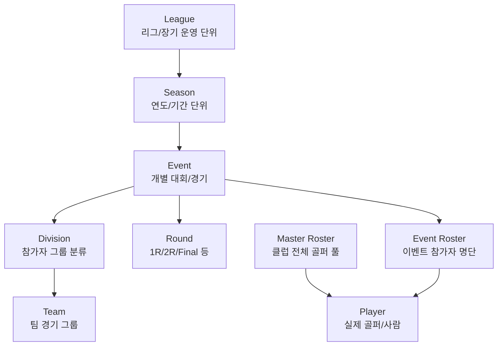
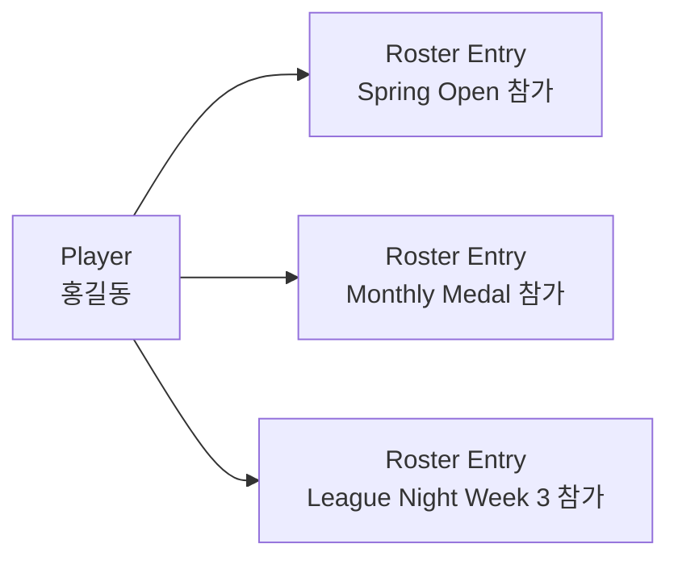
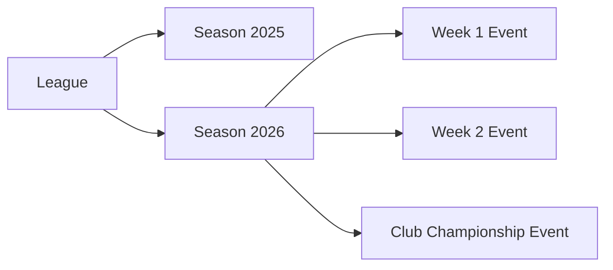

# Golf Genius 용어 정의

[← 개요](./index.md) | [다음: 데이터 모델 →](./data-model.md)

---

## 핵심 용어 관계 요약



---

## 용어 상세 설명

### Player

#### 의미
Player는 가장 기본이 되는 **사람(골퍼)** 개체다.
이름, 이메일, 성별, 생년월일, 핸디캡 등의 개인 속성이 여기에 연결된다.

#### 해석 포인트
- Golf Genius API 스니펫에서 Roster 응답에 name, email, handicap 등이 보인다.
- 실제 API 응답에서는 Player 성격의 속성과 Event 참가 성격의 속성이 함께 섞여 내려올 수 있다.
- 설계적으로는 다음 두 층을 구분한다:
  - **Player Master**: 사람 자체의 공통 프로필
  - **Event Participant / Roster Entry**: 특정 이벤트 참가자로서의 상태

#### Smartscore 연동 관점
Player는 Smartscore의 회원/골퍼 식별 체계와 매핑되는 핵심 엔터티가 된다.
다만 실제 연동에서는 아래를 분리해야 한다:
- Golf Genius의 Player ID
- Smartscore의 Member/User ID
- 외부 핸디캡 식별자(GHIN 등 가능성)

---

### Roster

#### 의미
Roster는 **특정 Event에 등록된 선수 목록**이다.
쉽게 말해 "이번 대회 참가자 명단"이다.

#### 공식 스니펫 근거
- "**This API returns the list of golfers in the event roster, together with all of their event-level data**"
- Roster는 단순 배열이 아니라 **Player와 Event를 연결하는 참여 테이블**로 보는 것이 맞다.

#### 핵심 해석
- Player = 사람 자체
- Event = 대회 자체
- Roster = 그 사람이 그 대회에 어떤 상태로 참가하는지

#### 포함될 가능성이 높은 속성
- event_id
- player_id
- registration status
- handicap for this event
- flight/division
- team assignment
- tee time / pairing context
- check-in status
- scoring eligibility

#### 왜 중요한가
실시간 스코어 연동에서 점수는 "Player 마스터"가 아니라 **Event 참가자 기준**으로 들어온다.
같은 Player라도 이벤트마다 다음이 달라질 수 있다:
- 적용 핸디캡
- 출전 여부
- 팀/조 편성
- 디비전
- 시작 시간
- 동반자

---

### Event

#### 의미
Event는 실제로 운영되는 **개별 대회 / 경기 / 토너먼트 단위**다.

#### 예시
- 2026 Spring Open
- 2026 Weekly League Match #3
- Member-Guest Tournament

#### Event가 중심인 이유
Golf Genius 공개 페이지에서 live scoring, tee times, leaderboards, event dashboard, event registrations 등이 강조된다.
대부분의 실시간 처리 포인트는 Event에 묶인다:
- 참가자 등록
- 조편성(pairings)
- 티타임
- 라운드 진행
- 스코어 입력
- 리더보드 갱신
- 결과 확정

---

### Round

#### 의미
Round는 Event 내부의 **라운드 단위 경기**다.

#### 역할
- 라운드별 시작/종료 상태 관리
- 라운드별 티타임/조편성
- 라운드별 스코어 카드
- 라운드별 리더보드 계산

#### Event와 Round 관계
Event는 한 번의 경기 전체이고, Round는 그 안의 세부 라운드다.
예를 들어 2라운드 대회라면:
- Event = 대회 전체
- Round 1 = 1일차
- Round 2 = 2일차

#### 실시간 전송에서 중요 포인트
실시간 점수는 거의 항상 Round 단위 문맥이 필요하다.
같은 Event라도 Round 1 스코어와 Round 2 스코어는 별도 기록이다.

---

### League

#### 의미
League는 반복적으로 운영되는 **리그/시리즈/연간 운영 단위**다.
Golf Genius 공개 페이지에서는 league schedule, season points, 반복 운영, 자동 pairings 등이 강조된다.

#### Event와의 차이
- **League**: 장기 운영 단위
- **Event**: 리그 내 개별 경기/대회

예:
- "수요 야간 리그 2026" = League
- "4월 2주차 경기" = Event

#### 왜 필요한가
리그는 누적 포인트, 누적 순위, 시즌 운영, 공지/포털/사진/참가 관리 같은 장기 컨텍스트를 갖는다.
League는 여러 Event를 묶는 상위 엔티티다.

---

### Season

#### 의미
Season은 League의 연도/기간별 운영 구간이다.
공식 스니펫상 season ID, season name, current 여부가 존재한다.

#### 공식 스니펫 근거
- "**Each season includes the season ID, the name and whether that season is marked as current.**"

#### 왜 필요한가
League가 매년 반복되면, 같은 League라도 시즌별로 아래가 달라진다:
- 참가자 풀
- 시즌 포인트
- 일정
- 이벤트 목록
- 규정
- 랭킹

Season은 단순 날짜 범위가 아니라 **League 하위의 독립 운영 단위**다.

#### current 플래그의 의미
current=true 는 보통 아래 중 하나로 활용된다:
- 현재 진행 중인 시즌
- 기본 조회 대상 시즌
- 포털/앱에서 기본 노출할 시즌

---

### Score / Leaderboard / Pairing

- **Score**: Round 또는 Hole-by-hole 결과 데이터
- **Leaderboard**: 이벤트/리그/시즌 문맥에서 집계된 결과 표현
- **Pairing**: 라운드의 조편성/티타임 구조

---

### Division

#### 의미
Division은 Event 내에서 **참가자를 그룹으로 분류**하는 단위다.
같은 Event라도 Division별로 독립적인 순위 산정 및 티타임 배정이 가능하다.

#### 예시
- Men's Division (남자부)
- Women's Division (여자부)
- Senior Division (시니어부)
- A Flight / B Flight / C Flight

#### API 근거
- 기본 Division: "All Golfers" (모든 참가자)
- Division별 `tee_times` 배열 지정 가능
- `playing_divisions`: 특정 라운드에서 경기하는 Division 지정

#### 핵심 포인트
- Division은 **"누가 경쟁하는가"**를 정의한다.
- 각 Division은 독립적으로 순위가 산정된다.

---

### Team

#### 의미
Team은 **Division 내부에서 플레이어를 팀으로 그룹화**하는 단위다.
팀 경기(2인 1조, 4인 1조 등)에서 같은 팀으로 스코어를 합산할 때 사용한다.

#### API 근거
> `team_id (optional, integer) - A unique identifier that is used in order to group players into teams within their allocated division. Ignored if division id is not set.`

- `team_id`는 `division_id`가 설정된 경우에만 유효하다.
- Division 없이 Team만 설정하면 무시된다.

#### 핵심 포인트
- Team은 **"누가 같은 편인가"**를 정의한다.
- 반드시 Division 내부에서만 의미를 가진다.

---

### Division vs Team 비교

| 구분 | Division | Team |
|------|----------|------|
| **레벨** | Event 레벨 | Division 내부 |
| **용도** | 참가자 그룹 분류 (경쟁 단위) | 팀 경기 시 플레이어 그룹화 |
| **기본값** | "All Golfers" | 없음 |
| **티타임** | Division별 지정 가능 | 해당 없음 |
| **필수 여부** | 선택 | Division 설정 시에만 유효 |

#### 계층 구조

```
Event: 2026 Club Championship
├── Division: A Flight (남자부)
│   ├── Team 1: 홍길동 + 김철수
│   ├── Team 2: 이영희 + 박민수
│   └── Team 3: 최동욱 + 정수현
│
├── Division: B Flight (여자부)
│   ├── Team 1: 박지현 + 최수연
│   └── Team 2: 김영희 + 이수진
│
└── Division: Senior Flight (시니어부)
    └── (개인전 - Team 없음)
```

#### 사용 시나리오

| 경기 유형 | Division 사용 | Team 사용 |
|-----------|---------------|-----------|
| 개인전 (남/여 구분) | ✅ 남자부, 여자부 | ❌ |
| 개인전 (핸디캡 구분) | ✅ A/B/C Flight | ❌ |
| 2인 팀전 (Scramble) | ✅ Flight 구분 | ✅ 2인 1조 |
| 4인 팀전 (Best Ball) | ✅ Flight 구분 | ✅ 4인 1조 |

---

## Player vs Roster 차이

**결론부터 말하면, 같은 의미로 보면 안 된다.**

### Player
- 사람 자체
- 여러 Event에 반복 참여 가능
- 공통 프로필 중심

### Roster
- 특정 Event의 참가 명단
- Player가 Event에 참가한 "관계"를 표현
- Event별 핸디캡/팀/조/상태 등 문맥 정보 포함 가능

### 비유
- Player = 회사의 직원 마스터
- Roster = 특정 프로젝트에 배정된 인원 명단

직원은 한 명이지만, 프로젝트마다 역할/상태/기간이 달라지듯,
Player도 Event마다 다른 Roster 상태를 가진다.



---

## Master Roster와 Event Roster

Golf Genius API에서는 "Roster"가 두 가지 레벨로 사용된다.

### 계층 구조

```
┌─────────────────────────────────────────────────────────┐
│  Master Roster (클럽/조직 레벨)                           │
│  = 클럽에 등록된 전체 골퍼 풀                              │
│                                                         │
│  ┌─────────┐  ┌─────────┐  ┌─────────┐  ┌─────────┐    │
│  │ Player  │  │ Player  │  │ Player  │  │ Player  │    │
│  │ (홍길동) │  │ (김철수) │  │ (이영희) │  │ (박민수) │    │
│  └─────────┘  └─────────┘  └─────────┘  └─────────┘    │
└─────────────────────────────────────────────────────────┘
                          │
                          ▼ (일부 Player가 Event에 참가)
┌─────────────────────────────────────────────────────────┐
│  Event: "2026 Spring Open"                              │
│                                                         │
│  └── Event Roster (이 이벤트 참가자 명단)                  │
│      ┌─────────┐  ┌─────────┐                           │
│      │ Player  │  │ Player  │                           │
│      │ (홍길동) │  │ (이영희) │                           │
│      └─────────┘  └─────────┘                           │
└─────────────────────────────────────────────────────────┘
```

### 용어 정리

| 용어 | 의미 | API 엔드포인트 |
|------|------|----------------|
| **Player** | 골퍼 한 명 (개인) | `/players/{player_id}` |
| **Master Roster** | 클럽에 등록된 **전체 Player 목록** | `/master_roster` |
| **Master Roster Member** | Master Roster 내 **특정 Player 1명** (이메일로 조회) | `/master_roster_member/{email}` |
| **Event Roster** | 특정 Event에 참가하는 **Player 목록** | `/events/{event_id}/roster` |

### API 근거

Golf Genius API 문서에서 직접 확인할 수 있는 내용:

> `player_id (numeric 22) - The ID of the player from Master Roster`

즉, `player_id`는 Master Roster에서 가져온다.

### Member vs Player

Golf Genius API에서 "Member"라는 용어가 등장하는 이유:
- **Master Roster Member**: Master Roster 내 특정 Player를 이메일로 조회할 때 사용
- **Member Registration**: Event Roster에 Player를 등록할 때 사용 (`/events/{event_id}/members`)

**결론: Member = Player**이다. API 설계상 다른 이름을 사용할 뿐, 실제로는 같은 엔티티를 의미한다.

### 핵심 포인트

1. **Master Roster** = 클럽 레벨의 전체 Player 풀
2. **Event Roster** = 특정 Event에 참가하는 Player들의 부분집합
3. **Player** = 개별 골퍼 (Master Roster에 소속)
4. **Member** = Player와 동일 (API 네이밍 차이일 뿐)

---

## League / Season / Event의 차이

| 용어 | 성격 | 시간 범위 | 포함 대상 | 예시 |
|---|---|---:|---|---|
| League | 장기 운영 컨테이너 | 길다 | 여러 Season 또는 여러 Event | 2026 수요 야간 리그 |
| Season | 기간/연도 단위 | 중간 | 여러 Event | 2026 시즌 |
| Event | 실제 경기/대회 | 짧다 | 여러 Round, Roster | 4월 2주차 경기 |
| Round | 이벤트 내 세부 경기 | 매우 짧다 | hole-by-hole scoring | Round 1 |

### 가장 자연스러운 관계
- League는 **운영 프로그램**
- Season은 **그 프로그램의 특정 연도/기간**
- Event는 **그 기간 내 실제 개최된 개별 경기**



---

## 내부 도메인 용어 사전

| Smartscore 내부 개념 | 한국어 해석 | Golf Genius 용어 |
|---|---|---|
| 회원 마스터 또는 외부 골퍼 마스터 | 선수 / 골퍼 | Player |
| 클럽 전체 회원 풀 | 마스터 명단 | Master Roster |
| 이벤트 참가 엔트리 | 참가자 명단 | Roster |
| event_participant 집합 | 이벤트 참가자 명단 | Event Roster |
| 경기 이벤트 | 대회 / 경기 | Event |
| 라운드 | 라운드 | Round |
| 상위 운영 컨테이너 | 리그 / 시즌형 운영 프로그램 | League |
| 리그 하위 기간 단위 | 시즌 / 연도 단위 | Season |
| 참가자 그룹 분류 | 디비전 / 부문 | Division |
| 팀 경기 그룹 | 팀 | Team |
| 실시간 순위판 | 리더보드 | Leaderboard |
| hole-by-hole score feed | 실시간 스코어 입력 | Live Scoring |
| 티타임/동반조 정보 | 조편성 | Pairings |

---

[← 개요](./index.md) | [다음: 데이터 모델 →](./data-model.md)
